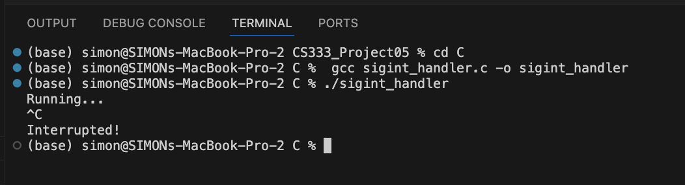
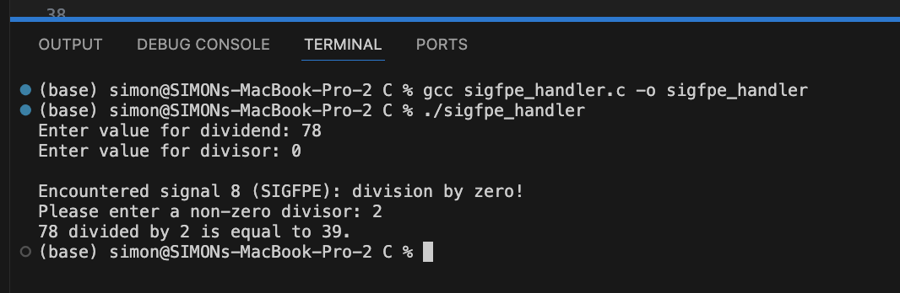
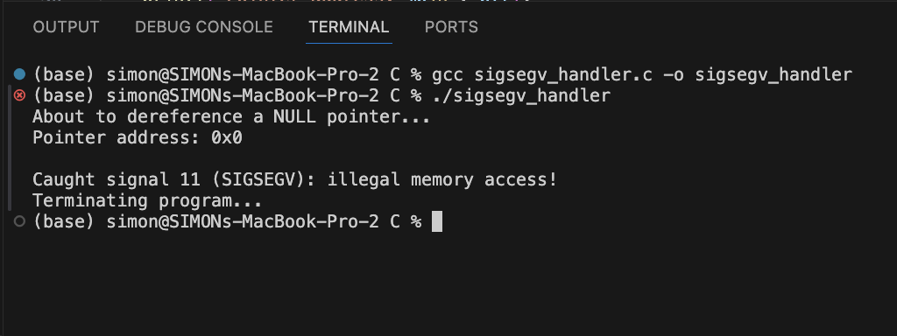
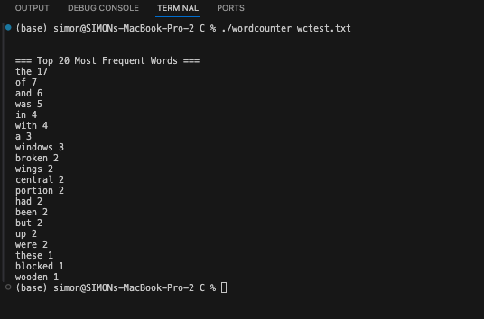
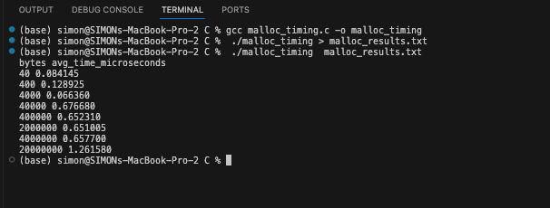
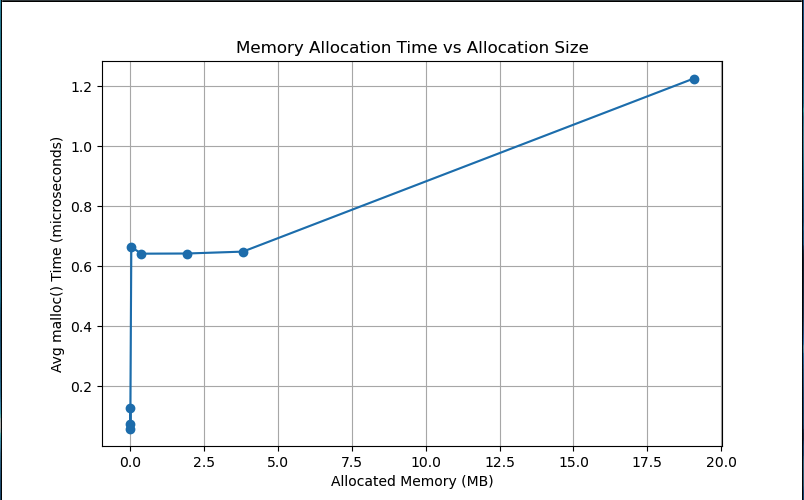
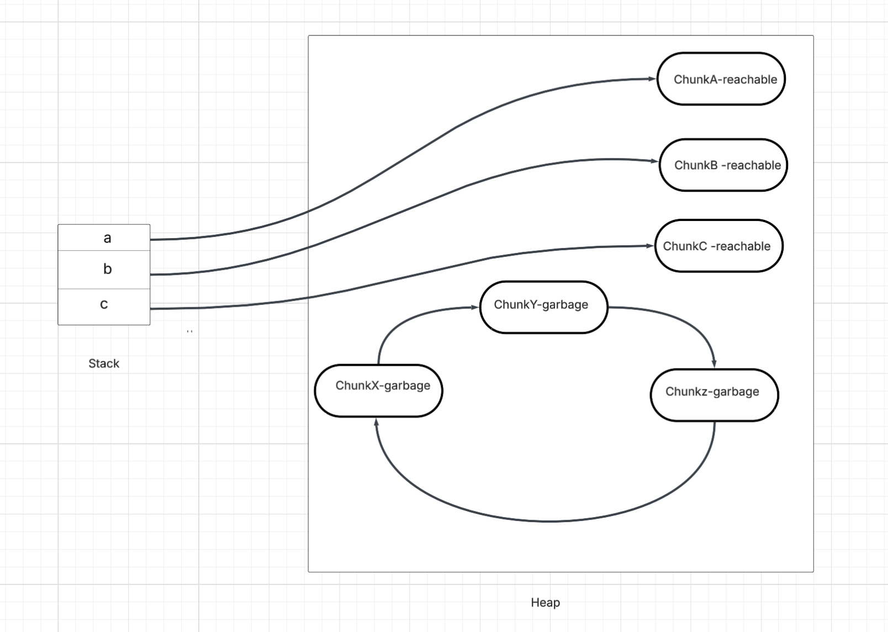
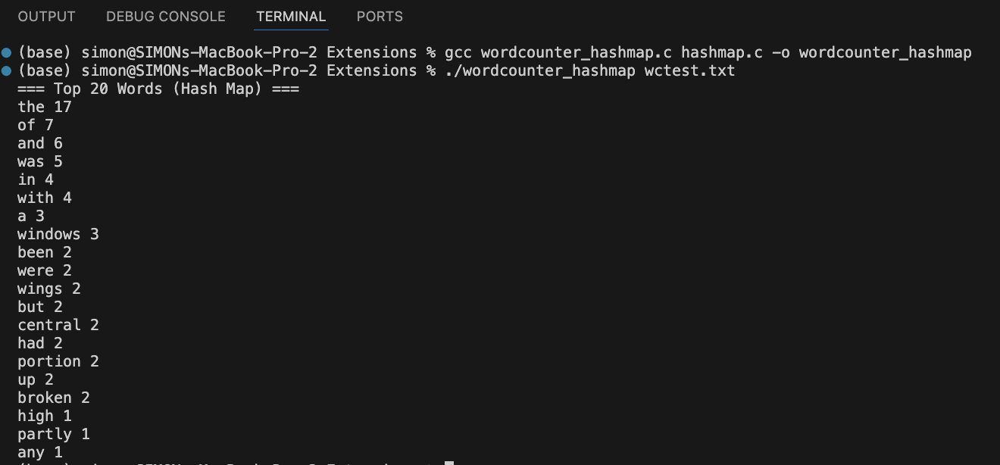
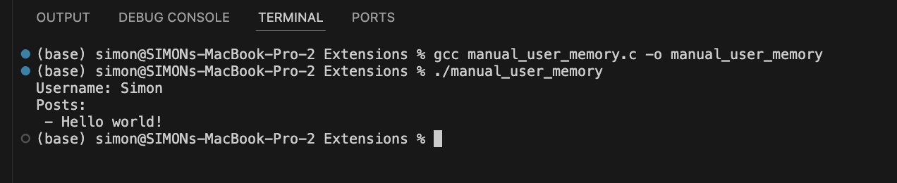
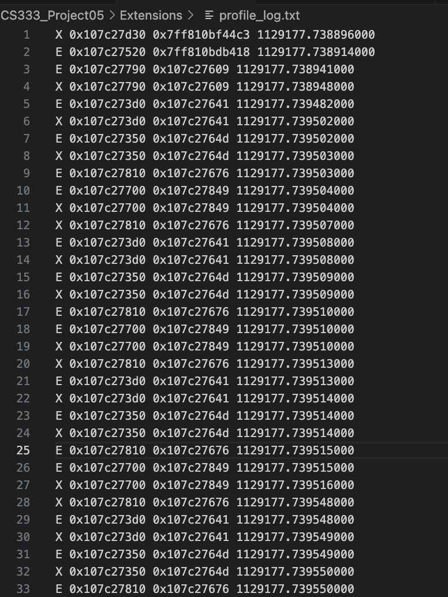

# CS333: Project 5: File I/O and Memory Management in C #
**Author:** Simon Lartey  
**Date:** November 17, 2025  
**Course:** CS333 – Programming Languages  
Google Sites Report:  https://sites.google.com/colby.edu/simon-project1/home/project5-js?authuser=0

##  Directory Layout
```
.
├── C
│   ├── detect_garbage.c
│   ├── linkedlist.c
│   ├── linkedlist.h
│   ├── malloc_results.txt
│   ├── malloc_timing.c
│   ├── plot_malloc_timing.py
│   ├── sigfpe_handler.c
│   ├── sigint_handler.c
│   ├── sigsegv_handler.c
│   ├── wctest.txt
│   └── wordcounter.c
├── Extensions
│   ├── hashmap.c
│   ├── hashmap.h
│   ├── linkedlist.c
│   ├── linkedlist.h
│   ├── manual_user_memory
│   ├── manual_user_memory.c
│   ├── profile_log.txt
│   ├── profiler.c
│   ├── profiler_wc
│   ├── profiler_wordcounter.c
│   ├── robust_wordcounter.c
│   ├── wctest.txt
│   ├── wordcounter_hashmap
│   └── wordcounter_hashmap.c
├── JS
│   ├── gc_experiment.js
│   ├── wctest.txt
│   └── wordcounter.js
├── README.md
└── screenshots
    ├── Extension1.png
    ├── Extension3.png
    ├── Extension4.png
    ├── extension2.png
    ├── graph.png
    ├── task1_a.png
    ├── task1_b.png
    ├── task1_c.png
    ├── task2.png
    ├── task3.png
    ├── task4.png
    └── task4_b.png

```

# OS and C compiler #
- **OS:** macOS Ventura 13.7.8  
- **C Compiler:** Apple clang version 15.0.0 (clang-1500.0.40.1)  
- **Architecture:** x86_64 (Intel-based Mac)

---


# Task 1: Signal Handling in C #

This part of the project explores how C programs can respond to runtime interrupts and fatal errors using system signals. Unlike higher-level languages, C does not automatically protect the programmer from events such as segmentation faults, floating-point exceptions, or user interrupts. Instead, the signal() function allows the programmer to install custom handlers that execute when specific signals occur. I implemented three separate programs—sigint_handler.c, sigfpe_handler.c, and sigsegv_handler.c—each demonstrating how to catch and process a different signal.

- ### Handling SIGINT (Ctrl-C) ###

This program installs a handler for the SIGINT signal, which is generated when the user presses Ctrl-C. The handler prints a short message and then exits the program cleanly using exit(0). The main function runs an infinite loop to keep the program active long enough for the user to interrupt it.

### How to Compile and Run: ###

``` How to run:
        gcc sigint_handler.c -o sigint_handler
        ./sigint_handler
```

### Output: ###




- ### Handling Floating-Point Exceptions (SIGFPE) ###

This program demonstrates how C handles illegal arithmetic operations, such as division by zero. After installing a handler for SIGFPE, the program prompts the user for two integers and attempts to divide them. If the divisor is zero, the handler prints a warning and prompts the user for a corrected value. Unlike most fatal signals, the program is able to continue execution safely because the handler returns control back to main.


### How to Compile and Run: ###

``` 
How to run:
     gcc sigfpe_handler.c -o sigfpe_handler
     ./sigfpe_handler

```

### Output: ###




- ### Handling Segmentation Faults (SIGSEGV) ###


The final program intentionally triggers a segmentation fault by attempting to access an invalid memory address. The installed SIGSEGV handler prints an error message and then exits the program gracefully. Although a real program should avoid segmentation faults altogether, this example shows how a handler can provide diagnostic information before termination.

```
 How to run:
      gcc sigsegv_handler.c -o sigsegv_handler
      ./sigsegv_handler

```

### Output: ###




# Task 2 – File I/O and Word-Frequency Counting in C #

For Task 2, I implemented a complete word-frequency counter in C to gain hands-on experience with file I/O and text processing. My program, written in wordcounter.c, reads a filename from the command line, opens the file safely, and processes each token while meeting all of the required specifications. To ensure case-insensitive counting, each word is converted to lowercase, and to handle punctuation correctly, I strip leading and trailing punctuation so that words like “Holmes.” and “Holmes,” are counted as the same token. As required, I used my linked list implementation from Project 4 to store and update word counts dynamically. Each cleaned word is either added to the list or incremented if it already exists. After reading the entire file, I extract all the linked-list nodes into an array and sort them in descending order of frequency so that I can print the top 20 most frequent words.  I tested the program using the provided wctest.txt file, and the output correctly matched the expected word-frequency distribution


```
How to run:
    gcc wordcounter.c linkedlist.c -o wordcounter
    ./wordcounter wctest.tx


```

### Output: ###




# Task 3 – Timing the Cost of Memory Allocation in C  #

For this task, I wrote a C program (malloc_timing.c) that measures the average time required for malloc() to allocate different amounts of memory. Each memory size was tested over 200,000 trials, and the very first malloc() was excluded to avoid initialization overhead. After compiling and running the program, I redirected the results into a text file and plotted the allocation time against the allocation size.





The graph shows that malloc() is extremely fast for very small allocations (tens to hundreds of bytes), taking well under 0.2 microseconds. As the allocation size increases into the kilobyte and small megabyte ranges, the time rises slightly and stabilizes around 0.6–0.7 microseconds. This indicates that the allocator handles these requests in nearly constant time. Only the very largest allocation, around 20 MB, shows a significant increase, rising above 1.2 microseconds. This is consistent with the fact that very large allocations may trigger additional system-level operations, such as requesting new pages from the operating system.

From these measurements, we can say that malloc() behaves essentially as an O(1) operation for typical allocation sizes. Allocating larger blocks is not noticeably slower until the size becomes extremely large. This means that, in practice, it is just as efficient to allocate a large chunk of memory at once as it is to allocate many smaller chunks, at least for common program sizes. The experiment confirms the expected behavior of modern heap allocators.


# Task 4 - Mark-and-Sweep Garbage Collector #

For Task 4, I implemented a simplified mark-and-sweep garbage collector in C to better understand how tracing garbage collection works under the hood. Since C does not provide automatic memory management, I simulated a small runtime system consisting of (1) a stack of variables, (2) a heap of allocated chunks, and (3) explicit references between heap objects.

Each stack variable is represented by a Var struct that stores a name and a pointer to a HeapChunk. Each heap chunk stores an array of outgoing references and a marked flag used during garbage collection. All allocated chunks are stored in an array in the ProgramState.

My collector follows the classic two-phase algorithm. In the mark phase, I start at every variable on the simulated stack and recursively traverse the heap using depth-first search, marking all reachable chunks:

```c

void dfsMark(HeapChunk *chunk) {
    if (!chunk || chunk->marked) return;
    chunk->marked = 1;
    for (int i = 0; i < chunk->num_references; i++)
        dfsMark(chunk->references[i]);
}

```


In the sweep phase, I iterate through the list of all allocated heap chunks and report whether each one is REACHABLE or GARBAGE, depending on its mark bit.

To demonstrate that the collector correctly handles cycles—where reference counting would fail—I created three reachable stack variables (a, b, c) and, separately, an unreachable cycle of three heap chunks (x -> y -> z -> x). Because the cycle cannot be reached from the stack, the collector correctly identifies all three nodes in the cycle as GARBAGE, while marking a, b, and c as REACHABLE.

### Output: ###


### Visualization of Heap Reachability and Cyclic Garbage: ###




# Part II – Overview (JavaScript Memory Management & Behavior) #

Part II of the project focused on exploring how JavaScript handles memory, errors, file operations, and garbage collection, in contrast to the manual memory model used in C. All tasks in this section were fully implemented in JavaScript, and the complete explanations, code samples, and screenshots are documented in detail on my Google Site.

In summary, Part II examined JavaScript’s automatic memory allocation, its built-in exception-handling system, the use of Node.js for local file I/O, and the behavior of JavaScript’s mark-and-sweep garbage collector under heavy memory pressure. I also rewrote the word-frequency task in JavaScript to directly compare its simplicity and flexibility to the C version. Additionally, I conducted a garbage-collection experiment by repeatedly allocating large arrays to observe timing spikes.


# Extensions #

- ### Extension 1: Implementing a Hash Map to Support the Word Frequency Task ###

In the linked-list version of the word-frequency program, every word lookup required walking through the entire list to determine whether the word already existed. This meant that inserting or updating a word took O(n) time, and processing n words produced a worst-case runtime of O(n²). To improve the efficiency of the program and demonstrate the use of a more advanced data structure, I rewrote the word counter using a hash map. A hash map distributes words across multiple “buckets” based on a hashing function, which allows the program to locate or insert a word in O(1) average time instead of scanning the entire list.
The hash map implementation uses a structure called HashNode, where each node stores a word, the word’s frequency, and a pointer to the next node in the same bucket. When a word is processed, its hash value is computed using a function such as:

```c

unsigned long hash(const char *str) {
    unsigned long h = 5381;
    int c;
    while ((c = *str++))
        h = ((h << 5) + h) + c;  // h * 33 + c
    return h;
}

```

This value determines which bucket the word belongs to. If the bucket already contains nodes, the program checks whether the word is already present. If it is, the count is incremented; if not, a new node is added to the bucket. The insertion logic looks like this:

```c
void hm_insert(HashMap *hm, const char *word) {
    unsigned long idx = hash(word) % hm->size;
    HashNode *node = hm->table[idx];

    while (node) {
        if (strcmp(node->word, word) == 0) {
            node->count++;
            return;
        }
        node = node->next;
    }

    // insert new node
    HashNode *newnode = malloc(sizeof(HashNode));
    newnode->word = strdup(word);
    newnode->count = 1;
    newnode->next = hm->table[idx];
    hm->table[idx] = newnode;
}
```

Because a hash map does not maintain words in sorted order, I extracted all nodes into an array and sorted them by frequency before printing the top twenty words. The comparator for sorting looks like this:

```c
int compare_nodes(const void *a, const void *b) {
    const HashNode *A = *(const HashNode **)a;
    const HashNode *B = *(const HashNode **)b;
    return B->count - A->count;   // sort descending
}
```

This approach produced the same output as the linked-list version, but with much better performance. For the test file wctest.txt, the hash-map version listed the most frequent words correctly, beginning with “the,” “of,” “and,” and “was,” followed by less frequent entries such as “windows,” “broken,” and “portion.” The correctness matches the linked-list version, but the runtime scales far better as the input size grows.
By replacing the linked list with a hash map, the lookup and insertion operations improved from O(n) time to O(1) average time. This changed the entire program from O(n²) to O(n) behavior. This extension not only demonstrates a significantly more efficient algorithm for text-processing tasks but also mirrors the way real programming languages implement symbol tables and frequency analysis internally. The improved structure clearly shows how the choice of data structure can dramatically affect performance when working with large data sets.

### How to run and Compile ###
```
Compile:
   gcc wordcounter_hashmap.c hashmap.c -o wordcounter_hashmap

Run:
    ./wordcounter_hashmap wctest.txt

```
### Output: ###




### Extension 2 – Improving the Robustness of the Word Counter ###

The original linked-list–based word-frequency program from Part I worked correctly under normal conditions, but it lacked important safeguards that real software typically requires. For instance, the program assumed that the user would always supply a valid filename, that the file would successfully open, and that every scanned token would be a valid word. Without additional checks, the program could behave unpredictably or crash when given incorrect input. The goal of this extension was to make the word counter significantly more robust, error-tolerant, and user-friendly, without changing its core functionality.

The first improvement involved validating the command-line arguments. If the user runs the program without a filename, the original version attempted to read from an undefined file pointer. The improved version checks the argument count and prints a clear usage message when the filename is missing:

```c 

if (argc < 2) {
    fprintf(stderr, "Usage: %s <filename>\n", argv[0]);
    return 1;
}
```

Next, I enhanced the program’s ability to handle invalid or non-existent files. The earlier implementation assumed that fopen() would succeed. If the file did not exist or could not be accessed, the program would crash. The updated version detects this situation and uses perror() to display an informative, system-generated error message:

```c
FILE *fp = fopen(argv[1], "r");
if (!fp) {
    perror("Error opening file");
    return 1;
}
```

This ensures that users immediately understand why the program cannot proceed.

Another improvement addressed the handling of text data. After stripping punctuation from the beginning and end of each token and converting it to lowercase, some strings may become empty—for example, when a token consists entirely of symbols. The improved version safely skips empty strings to prevent them from being inserted into the list:

```c
strip_punct(buffer);
str_to_lower(buffer);

if (strlen(buffer) == 0)
    continue;
```

This prevents malformed entries from polluting the frequency count and makes the results more accurate.

Finally, I ensured that all dynamically allocated memory is properly freed at the end of program execution. The linked list is cleared node by node using a custom free function, and the array used for sorting the word nodes is also freed. This guarantees that the improved version does not leak memory, even when processing large input files.

To verify the improvements, I tested several scenarios:
-  Missing filename
Running the program with no arguments correctly displays a usage message:
```
./robust_wordcounter
Usage: ./robust_wordcounter <filename>
```
- File not found

Running the program with an invalid filename correctly reports the system error:

./robust_wordcounter nope.txt
Error opening file: No such file or directory

- Valid file

Using the provided test file produces the expected top-20 word list, confirming that the core functionality remains intact.
These results demonstrate that the program not only produces correct word-frequency output but also handles user errors gracefully and avoids unsafe behavior. This extension significantly strengthens the resilience and practicality of the word counter while maintaining a clean design and full memory safety.


### HOw to Compile and Run ##

```
How to run:
    gcc robust_wordcounter.c linkedlist.c -o robust_wordcounter
    ./robust_wordcounter filename.txt
```
### Output ###


# Extension 3: Rewriting a JavaScript Memory-Management Example in C #

To better understand the contrast between automatic and manual memory management, this extension required taking a short example written in JavaScript—a language with automatic garbage collection—and recreating the same functionality in C, where memory allocation and cleanup must be handled explicitly by the programmer. For this purpose, I designed a simple JavaScript example that creates a user object with a username and a dynamic list of posts. This example is small enough to be easy to analyze, but still demonstrates how JavaScript allocates, grows, and eventually frees memory automatically.

The JavaScript version of the example constructs a user object and pushes strings into an array of posts:
```js
function createUser(name) {
    return { username: name, posts: [] };
}

let u1 = createUser("Simon");
u1.posts.push("Hello world!");
```

In JavaScript, memory allocation is automatic. Creating an object allocates memory on the heap. Growing the array using push() automatically resizes internal buffers. When the program finishes or the object becomes unreachable, JavaScript’s garbage collector reclaims the memory without any intervention from the programmer. The simplicity of this example highlights the power of automatic memory management: the programmer never thinks about allocation, resizing, or releasing memory.

To recreate this example in C, I implemented a similar user structure that stores a username and a dynamically resizable array of posts. However, because C does not provide garbage collection, every piece of memory must be allocated and released manually. The equivalent C version begins by constructing the User struct with malloc() and copying the username:

```js
User *createUser(const char *name) {
    User *u = malloc(sizeof(User));
    u->username = strdup(name);
    u->post_count = 0;
    u->posts = NULL;
    return u;
}
```

Where JavaScript simply assigns username: name, C must explicitly duplicate the string using strdup() to ensure proper memory ownership. Adding posts requires resizing the posts array using realloc(), a step that JavaScript performs automatically when an array grows:

```js
void addPost(User *user, const char *post) {
    user->post_count++;
    user->posts = realloc(user->posts, user->post_count * sizeof(char *));
    user->posts[user->post_count - 1] = strdup(post);
}
```

This section highlights the most important contrast: JavaScript hides allocation and resizing behind simple operations like push(), whereas C exposes the underlying memory operations directly. If the programmer mismanages the memory (for example by forgetting to check for allocation failure), the program may crash or leak memory.

The difference becomes even more apparent during cleanup. JavaScript frees memory automatically when objects are no longer reachable. In C, the programmer must explicitly release every dynamically allocated string and structure:
```js
void freeUser(User *user) {
    for (int i = 0; i < user->post_count; i++)
        free(user->posts[i]);

    free(user->posts);
    free(user->username);
    free(user);
}
```

This manual cleanup ensures that the program does not leak memory, but it also demonstrates the complexity that C programmers must manage compared to JavaScript developers.

What differs is not the functionality, but the amount of responsibility placed on the programmer. JavaScript handles allocation, resizing, and cleanup automatically through a garbage collector, whereas C requires precise manual control over every piece of memory. This exercise demonstrates clearly why memory-safe languages reduce many categories of bugs, while languages like C offer greater control at the cost of increased risk and complexity. Overall, rewriting an automatically managed JavaScript example in C provides a valuable and concrete illustration of the differences in memory models between the two languages.


### how to compile and Run
```
Compile:
    gcc manual_user_memory.c -o manual_user_memory
Run:
    ./manual_user_memory
```

### Output ###





### Extension 4: Profiling ###
To profile the performance of my hash-map word-counter, I compiled the program with the -finstrument-functions flag, which causes the compiler to automatically insert calls to two special functions—__cyg_profile_func_enter() and __cyg_profile_func_exit()—at the beginning and end of every function in the program. I implemented these hook functions in a separate file (profiler.c), where each one records a log entry containing whether a function was entered or exited, the memory address of the function, the return address, and a precise timestamp measured in microseconds. When the program runs, these entries are appended line by line to profile_log.txt, creating a detailed trace of the program’s execution.


Each line shows either an E (function entry) or X (function exit), followed by the function’s address, the return address, and a timestamp. My full profiling run produced 1,394 lines, which reflects how often certain functions are called during word counting. The dense clusters of repeating pairs in the log correspond to the functions that dominate the runtime of the program—specifically the hash map’s insertion and lookup routines, string comparison (strcmp), hashing, and the token-processing code that cleans and normalizes each word. These operations run once for every word in the input file, so it is expected that they appear hundreds of times in the trace. In contrast, functions involved in sorting the final list of words appear only a few times because they run only once at the end of execution.

The profiler output confirms that the majority of execution time occurs inside the inner loop where each word is inserted into the hash map. This supports the improvements introduced earlier in the project: switching from a linked list to a hash map significantly reduces repeated traversal, and the profiling log shows that the program now spends most of its time performing constant-time hashing and bucket checks rather than O(n) list scans. Although the instrumentation itself adds overhead, it clearly reveals the structure of the program’s execution and identifies which components are most active. Overall, this profiling extension provides a low-level look at the performance behavior of the C implementation and validates the efficiency gains achieved through better data-structure design.

 ### How Run and Compile compile: ###
     
```
gcc profiler_wordcounter.c hashmap.c profiler.c -finstrument-functions -o profiler_wc
     ./profiler_wc wctest.txt  

```

### Output ###

