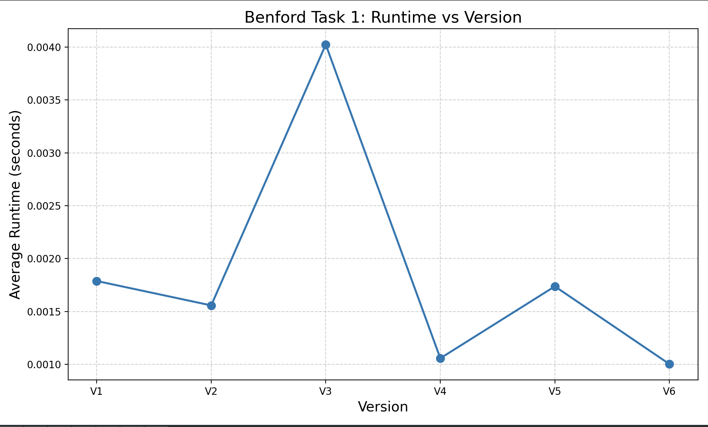
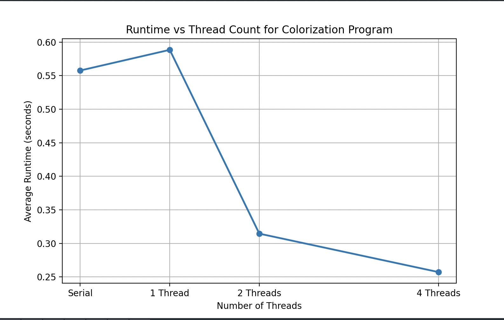
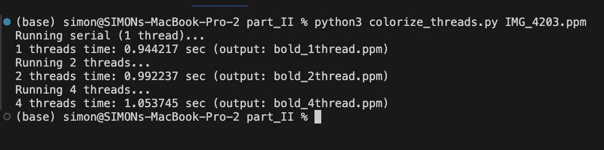
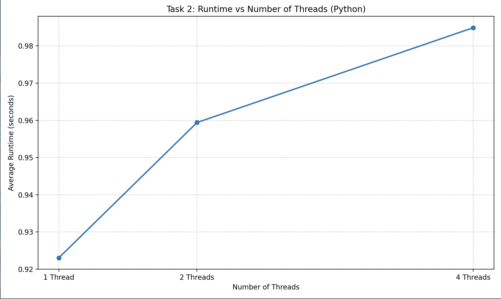
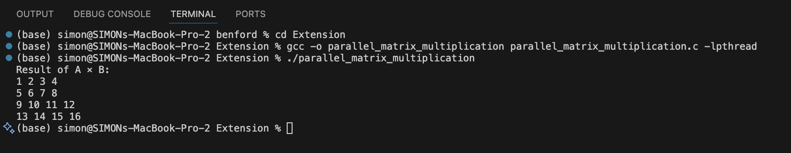
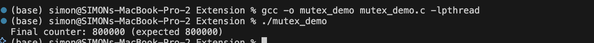

# CS333: Project 6: Parallel Programming in C #
**Author:** Simon Lartey  
**Date:** November 30, 2025  
**Course:** CS333 – Programming Languages  
Google Sites Report:  https://sites.google.com/d/1tcLCxPuOoiGb505CZp0OQf4W9uORk1_7/p/1QxFzS0yrAUFRFCXnw5rlSTVStIhLS6bf/edit

##  Directory Layout
```
.
├── Extension
│   ├── mutex_demo.c
│   └── parallel_matrix_multiplication.c
├── README.md
├── part_I
│   ├── benford_helper.c
│   ├── benford_par_global_array_mutex.c
│   ├── benford_par_global_digit_array.c
│   ├── benford_par_global_single_mutex.c
│   ├── benford_par_global_thread_array.c
│   ├── benford_par_local_array_mutexes.c
│   ├── benford_par_local_single_mutex.c
│   ├── benford_sequential.c
│   ├── benford_task1_graph.png
│   ├── kit
│   │   ├── IMG_4203.ppm
│   │   ├── bold.ppm
│   │   ├── colorize.c
│   │   ├── colorize_1thread.c
│   │   ├── colorize_2thread.c
│   │   ├── colorize_4thread.c
│   │   ├── colorize_serial.c
│   │   ├── graph.py
│   │   ├── my_timing.c
│   │   ├── my_timing.h
│   │   ├── ppmIO.c
│   │   └── ppmIO.h
│   ├── medium.bin
│   ├── my_timing.c
│   ├── my_timing.h
│   └── plot_benford_task1.py
├── part_II
│   ├── IMG_4203.ppm
│   ├── bold_1thread.ppm
│   ├── bold_2thread.ppm
│   ├── bold_4thread.ppm
│   ├── colorize_threads.py
│   ├── plot_task2.py
│   └── pyppmIO.py
└── screenshots
    ├── extension1.png
    ├── extension3.png
    ├── part1_task1.png
    ├── part1_task2.png
    └── partII_task2.png


```

# OS and C compiler #
- **OS:** macOS Ventura 13.7.8  
- **C Compiler:** Apple clang version 15.0.0 (clang-1500.0.40.1)  
- **Architecture:** x86_64 (Intel-based Mac)

---


## Task 1 ##

I implemented six versions of the Benford counter, each using a different strategy for storing and updating digit counters. All versions process the same dataset and count how many times digits 1–9 appear as the leading digit. The differences lie in how threads share or protect the counters.

Each version was compiled and run using 8 threads, and I measured the total runtime for each approach. To reduce noise, I ran each program five times and used the middle three values to compute an average runtime.

## Implemented Versions ##

**V1 – Global Counter Array, Single Mutex**

All threads increment a shared global array that tracks digit frequencies. Because every update must acquire the same mutex, this version suffers from heavy lock contention and reduced parallel efficiency.

**V2 – Global Counter Array, Array of Mutexes**

Instead of one lock for all digits, each digit has its own mutex. Threads only lock the specific digit they are updating, reducing contention significantly. Still, frequent locking/unlocking adds overhead.

**V3 – Local Counter Array, Final Update with Single Mutex**

Each thread counts digits privately in its own local array, eliminating contention during the counting phase. Afterward, each thread uses one global mutex to merge its results. This reduces—but does not eliminate—mutex delays.

**V4 – Local Counter Array, Final Update with Array of Mutexes**

Similar to V3, but instead of one merge mutex, each digit has its own mutex. Merging is more parallel and reduces merge-phase contention even further, generally making this faster than V3.

**V5 – Global Array of Arrays (Grouped by Thread), No Mutex Needed**

A global 2D array is allocated where each thread writes to a dedicated row. No two threads write to the same memory, so no locks are required. After the threads finish, the main thread sums the rows. This version is typically very efficient.

**V6 – Global Array of Arrays (Grouped by Digit), No Mutex Needed**

Similar to V5, but the 2D array is arranged by digit instead of thread. Each digit has a row, and threads write into different columns. This layout improves cache locality during the final reduction and is often the fastest overall.


### How to Run and Compile ###
```c
// Compile all versions
gcc -o benford_sequential benford_sequential.c benford_helper.c my_timing.c -lpthread
gcc -o benford_par_global_single_mutex   benford_par_global_single_mutex.c   benford_helper.c my_timing.c -lpthread
gcc -o benford_par_global_array_mutex    benford_par_global_array_mutex.c    benford_helper.c my_timing.c -lpthread
gcc -o benford_par_global_digit_array    benford_par_global_digit_array.c    benford_helper.c my_timing.c -lpthread
gcc -o benford_par_local_single_mutex    benford_par_local_single_mutex.c    benford_helper.c my_timing.c -lpthread
gcc -o benford_par_local_array_mutexes   benford_par_local_array_mutexes.c   benford_helper.c my_timing.c -lpthread
gcc -o benford_par_global_thread_array   benford_par_global_thread_array.c   benford_helper.c my_timing.c -lpthread

// Run all versions
./benford_sequential
./benford_par_global_single_mutex
./benford_par_global_array_mutex
./benford_par_global_digit_array
./benford_par_local_single_mutex
./benford_par_local_array_mutexes
./benford_par_global_thread_array


```


## Results ##

I collected runtime values for each version (five runs each) and calculated the average using the middle three values.


| Version | File Name                         | Run 1     | Run 2     | Run 3     | Run 4     | Run 5     | Sorted (Low→High)                                   | Avg (Middle 3) |
|---------|-----------------------------------|-----------|-----------|-----------|-----------|-----------|-----------------------------------------------------|----------------|
| **V1**  | benford_par_global_single_mutex   | 0.002393  | 0.001801  | 0.001829  | 0.001463  | 0.001733  | 0.001463, 0.001733, 0.001801, 0.001829, 0.002393   | **0.001788**   |
| **V2**  | benford_par_global_array_mutex    | 0.007460  | 0.001393  | 0.001412  | 0.001390  | 0.001867  | 0.001390, 0.001393, 0.001412, 0.001867, 0.007460   | **0.001557**   |
| **V3**  | benford_par_local_single_mutex    | 0.005420  | 0.008438  | 0.000868  | 0.001078  | 0.005575  | 0.000868, 0.001078, 0.005420, 0.005575, 0.008438    | **0.004024**   |
| **V4**  | benford_par_local_array_mutexes   | 0.001518  | 0.004910  | 0.000873  | 0.000781  | 0.000757  | 0.000757, 0.000781, 0.000873, 0.001518, 0.004910    | **0.001057**   |
| **V5**  | benford_par_global_thread_array   | 0.003357  | 0.007694  | 0.000831  | 0.000807  | 0.001023  | 0.000807, 0.000831, 0.001023, 0.003357, 0.007694    | **0.001737**   |
| **V6**  | benford_par_global_digit_array    | 0.001131  | 0.001304  | 0.000931  | 0.000943  | 0.000853  | 0.000853, 0.000931, 0.000943, 0.001131, 0.001304    | **0.001002**   |


## Graph: Runtime vs Version ##

To visualize the performance differences, I plotted the average runtime for all six versions.

### How to generate the graph ###
```
python3 plot_benford_task1.py

```

## Output ##




## Analysis ##

After running all six implementations, I observed significant differences in performance depending on how synchronization and data structures were used.
V1 (single mutex) performed moderately but suffered from heavy contention because every update required locking the same mutex.
V2 (per-digit mutexes) improved runtime slightly by reducing contention, since threads only lock the mutex for the digit they are updating.
V3 (local arrays + single final mutex) performed noticeably worse than expected. Even though threads compute locally, the merging stage uses a single mutex and becomes a bottleneck, leading to the highest runtime.
V4 (local arrays + per-digit mutexes) improved significantly. Because the final merging uses 10 separate locks, contention is reduced and runtime drops sharply.
V5 (thread-grouped array, no mutex) was fast because no locking was required during counting; each thread writes to its own memory region.
V6 (digit-grouped array, no mutex) was the fastest. With no mutexes, minimal contention, and better memory locality, it outperformed all other versions.

Overall, I found that:
- Avoiding shared writes entirely (V5 and V6) gives the best performance.
- Local computation + smarter merging (V4) is a strong middle ground when avoiding locking is not possible.
- Single-mutex solutions scale poorly due to high contention (V1 and especially V3).
- Memory layout matters: V6 outperformed V5 even though both avoid mutexes.


This task demonstrated how different synchronization strategies and memory layouts affect performance in parallel programs. The results clearly show that:
The more we reduce shared-state contention, and the more we design memory layouts that avoid false sharing, the faster the parallel program becomes.
Version V6 provided the best performance overall, while V3 was the slowest. 

## Task 2 - Parallel Image Colorization

For this task, I wrote a program that reads a PPM image and applies a pixel-wise operator to every pixel. I used the provided C-kit (ppmIO.c and ppmIO.h) to handle image input and output.I also to compare the computation time of a serial implementation against parallel versions using 1, 2, and 4 threads. To make timing meaningful, I repeated the pixel-wise operation multiple times in each version of the code.

I implemented four versions of the program:
- Serial version (no threads)
- 1-thread version (uses pthreads but only one worker thread)
- 2-thread version
- 4-thread version

All versions apply the exact same pixel-wise operation and produce identical output (bold.ppm).
The only difference between them is how many threads process the pixel data.
Because a single pass through the image is too fast to measure reliably, I added a repetition loop that processes the entire image 20 times. This allowed me to measure clear differences in performance between different thread counts, as required.

## How I Compiled the Code ##
```
gcc -o colorize_serial   colorize_serial.c   ppmIO.c my_timing.c -lpthread
gcc -o colorize_1thread  colorize_1thread.c  ppmIO.c my_timing.c -lpthread
gcc -o colorize_2thread  colorize_2thread.c  ppmIO.c my_timing.c -lpthread
gcc -o colorize_4thread  colorize_4thread.c  ppmIO.c my_timing.c -lpthread
```

## How to run ##
```
./colorize_serial IMG_4203.ppm
./colorize_1thread IMG_4203.ppm
./colorize_2thread IMG_4203.ppm
./colorize_4thread IMG_4203.ppm
```

Each run generated an output image named bold.ppm.

## Timing Results ##
To collect timing data, I ran each version five times. Then, as required, I dropped the minimum and maximum values and computed the average of the middle three runs.


### How to run and compile ###

```c
// Compile all versions
gcc -o colorize_serial   colorize_serial.c   ppmIO.c my_timing.c -lpthread
gcc -o colorize_1thread  colorize_1thread.c  ppmIO.c my_timing.c -lpthread
gcc -o colorize_2thread  colorize_2thread.c  ppmIO.c my_timing.c -lpthread
gcc -o colorize_4thread  colorize_4thread.c  ppmIO.c my_timing.c -lpthread

// Run all versions
./colorize_serial IMG_4203.ppm
./colorize_1thread IMG_4203.ppm
./colorize_2thread IMG_4203.ppm
./colorize_4thread IMG_4203.ppm

```
## Output ##


| Version       | Run 1     | Run 2     | Run 3     | Run 4     | Run 5     | Avg (mid 3) |
|--------------|-----------|-----------|-----------|-----------|-----------|--------------|
| Serial       | 0.538933  | 0.614723  | 0.550596  | 0.547926  | 0.574399  | 0.557640     |
| 1 Thread     | 0.606615  | 0.577336  | 0.565785  | 0.601569  | 0.586362  | 0.588422     |
| 2 Threads    | 0.314601  | 0.309554  | 0.319533  | 0.306991  | 0.413174  | 0.314563     |
| 4 Threads    | 0.250423  | 0.322818  | 0.255864  | 0.257809  | 0.258304  | 0.257326     |


## Graph of Computation Times ##
I created a graph showing the relationship between the number of threads and the computation time.


### How to generate the graph ###

```
python3 graph.py

```
## Output ##




## Analysis ##
The results show that the serial and 1-thread versions perform almost the same, with the 1-thread version running slightly slower. This behavior is expected: using only one thread introduces thread-creation and management overhead but provides no parallel benefit, so the serial program often matches or outperforms the single-thread version.

When the program is parallelized with 2 threads, the runtime drops significantly. The colorization operation is parallel; each pixel can be processed independently, so dividing the work between two threads immediately improves performance. With two threads, the CPU can work on separate parts of the image simultaneously, reducing total execution time.

Increasing to 4 threads yields an additional improvement, although the speedup is no longer proportional to the number of threads. This diminishing return is common in parallel programs and is caused by factors such as thread scheduling overhead, contention for CPU cores, memory-cache effects, and the fact that the machine may not have 4 fully independent hardware cores available. Despite these overheads, the 4-thread version still performs better than the 2-thread version.

Overall, the results demonstrate that parallelism effectively reduces computation time for this pixel-wise image operation. The largest performance gain occurs when moving from 1 to 2 threads, while additional threads continue to improve performance but at a slower rate. 


## Part II ##

### Task 2 – Parallel Image Processing (Python Version) ##


For Part II, I decided to complete the task in Python. Python supports threads through the threading module, but because of the Global Interpreter Lock (GIL), threads do not run CPU-bound work in true parallel. Still, the assignment asks us to re-implement Task 2 from Part I using 1, 2, and 4 threads and compare execution times.

I used the PIL Image module (as suggested in the instructions) to open the .ppm file, obtain the pixel map, divide the image by rows, and let each thread process its assigned region. I measured the runtime for each thread count five times, removed the minimum and maximum values, and averaged the middle three.

Below is the table showing all five runs for each thread count, along with the average of the middle three:
### How to run ###
```
python3 colorize_threads.py IMG_4203.ppm
```

### Output from a single run ###



| Version    | Run 1     | Run 2     | Run 3     | Run 4     | Run 5     | Avg (Middle 3) |
|------------|-----------|-----------|-----------|-----------|-----------|----------------|
| 1 Thread   | 0.911616  | 0.914358  | 0.904416  | 0.995253  | 0.943180  | 0.923051       |
| 2 Threads  | 0.944186  | 0.938288  | 1.161470  | 0.973843  | 0.960213  | 0.959414       |
| 4 Threads  | 1.002804  | 0.972737  | 1.154944  | 0.970505  | 0.979168  | 0.984903       |


Below is the graph that visualizes the average runtime for 1, 2, and 4 threads:


## How to generate graph ###
```
python3 plot_task2.py
```




## Analysis ##

The results show that the 1-thread version ran the fastest, while the 2-thread and 4-thread versions were slightly slower. This matches Python’s behavior: because of the GIL, CPU-bound code cannot run threads in parallel, so adding threads increases overhead without improving speed.
No mutexes were needed, since each thread worked on a different region of the pixel map.

Python threads do not speed up CPU-intensive tasks. Unlike the C versions from Part I, increasing the number of threads did not reduce runtime. This experiment highlights the limitations of Python threading for computation-heavy work.


## Extension ##

### Extension 1: Parallel Matrix Multiplication in C ###

For my extension, I implemented parallel matrix multiplication using Pthreads in C. 
In my implementation, I created two square matrices, A and B, and computed the product C = A × B. Matrix A is filled with increasing values so the final output is easy to inspect, and matrix B is set to the identity matrix. Using the identity matrix ensures that the expected result is simply A itself, which provides a straightforward correctness check. The program dynamically allocates each matrix, determines how many rows each thread should process, and launches a fixed number of threads (four in this case). Every thread receives a starting row index, an ending row index, and pointers to A, B, and the result matrix C. Each thread independently computes all columns of its assigned rows, writing final values directly into C. After all threads complete their work and join back to the main thread, the program prints the full resulting matrix.

Because each thread writes to distinct rows of the result matrix and no shared region is modified concurrently, the code requires no synchronization mechanisms. This keeps the implementation simple and allows each thread to compute continuously without waiting on others. The final output matches matrix A exactly, confirming that the parallel computation works as intended. The output is shown below:

### How to run and Compile ##
```
gcc -o parallel_matrix_multiplication parallel_matrix_multiplication.c -lpthread

./parallel_matrix_multiplication


```




### Extension 2 : Parallelism in SQL ###

My second selected Language,SQL, does not allow explicit thread-based parallelism like C or Python, but modern database engines perform parallel query execution internally. On my Google Site, I explained how SQL supports implicit parallelism through features such as parallel scans, joins, and aggregations, and discussed why Tasks 1 and 2 from Part I cannot be directly implemented in SQL. I also described how parallelism inside the database engine could speed up similar computations if the data were stored in tables.


### Extension 3: Demonstrating a Mutex Lock in C ##

For this extension, I wrote a small C program that demonstrates how a mutex lock controls access to a critical section in a multithreaded environment. When several threads update the same shared variable at the same time, the program can easily produce incorrect results due to race conditions. Even a simple operation such as incrementing an integer is not atomic—multiple threads can read the same value before any of them writes it back, causing lost updates and an incorrect final count. Because of this, mutual exclusion is required to ensure each update happens safely.

To illustrate this clearly, I created a program where multiple threads increment a shared counter a fixed number of times. Without synchronization, the final counter value would end up much lower than expected, since threads would constantly overwrite each other’s updates. In the corrected version, each increment operation is wrapped inside a mutex-protected critical section using pthread_mutex_lock() and pthread_mutex_unlock(). This ensures that only one thread can modify the shared counter at any given moment, preventing race conditions entirely.

The program creates eight threads, and each thread performs 100,000 increments. After all threads finish, the main thread prints the final counter value. With proper locking, the final value should match the expected total (800,000). Running the program confirmed this: the output shows that the counter reached the exact correct value, demonstrating that the mutex successfully enforced exclusive access and protected the integrity of the shared data.

Here is the runtime output from the program:

### How to run and Compile ##
```
gcc -o mutex_demo mutex_demo.c -lpthread
./mutex_demo


```

