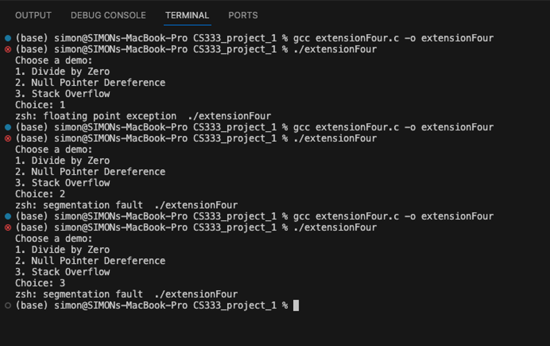

# CS333 - Project 1 - README
### Simon LARTEY
### O9/18/2025

***Google Sites Report: https://sites.google.com/colby.edu/simon-project1/home/project-1 ***

## Directory Layout:
```
project1_slarte27 
├── README.md
├── Screenshots
│   ├── Extension1.png
│   ├── Extension2.png
│   ├── Extension3.png
│   ├── Extension4.png
│   ├── Structure1.png
│   ├── Structure2.png
│   ├── Structure3.png
│   ├── Task1.png
│   ├── Task2(1).png
│   ├── Task2.png
│   ├── Task3_with_free.png
│   ├── Task3_without_free.png
│   ├── Task4.png
│   └── Task5.png
├── TaskFive
├── TaskFive.c
├── TaskFour
├── TaskFour.c
├── TaskOne.c
├── TaskSix.c
├── TaskThree
├── TaskThree.c
├── TaskTwo.c
├── extension
├── extensionFour
├── extensionFour.c
├── extensionOne
├── extensionOne.c
├── extensionThree
├── extensionThree.c
├── extensionTwo
└── extensionTwo.c
```
## OS and C compiler
OS: OSX Ventura 13.6.7 
C compiler: Apple clang version 15.0.0 (clang-1500.0.40.1)

## Part I 
### task 1
**Compile:** $ gcc -o TaskOne.c TaskOne

**Run:** $ ./TaskOne

**Output:**


**Q.b.** 

My machine is little-endian. 

**Q.c.** 

This is evident from the memory layout of multi-byte types (short, int, long). For example:
For the integer 0x11223344, the program prints the bytes as 44 33 22 11. The least significant byte (0x44) is stored at the lowest memory address. For the short 0x55AA, the program prints the bytes as AA 55, again showing the least significant byte (0xAA) first. For the long 0x5566778899AABBCC, the program prints the bytes starting with CC and ending with 55. In all cases, the least significant byte appears first in memory, confirming that the machine uses little-endian representation.

 

### Task 2

**Compile:** $ gcc -o TaskTwo.c TaskTwo

**Run:** $ ./TaskTwo

**Output:**


.png)


**Q.b.** 

The overall layout of the stack shows that local variables are stored close to each other in memory, generally from the most recently declared (ptr) back through the earlier declarations (long, int, short, char). Although the stack typically grows downward in memory, when we increment a pointer, we see variables appear in order. Each variable occupies the number of bytes consistent with its type (e.g., ptr = 8 bytes, long = 8 bytes, int = 4 bytes).

**Q. c.**

Yes. For example, starting around index 24 there are non-zero values in the memory dump that I cannot immediately make sense of, since they do not match any of the variables I explicitly declared in the program.

**Q. d.**

Yes, I can identify the variables. The first 8 bytes correspond to the ptr variable (an 8-byte address). The next 8 bytes belong to long_integer. Following that, 4 bytes correspond to integer, then 2 bytes to short_integer, and finally 1 byte for character. I know this by comparing the sizes of each type with the order in which they were declared.


### task 3
**Compile:** $ gcc -o TaskThree TaskThree.c

**Run:** $ ./TaskThree

**Output:**
#### Without free()


**Output:**
#### With free()


**Q.b.** 

Without free(): The program’s memory usage continuously increases because each loop allocates new memory without releasing it. This causes a memory leak, and over time the program consumes large amounts of system memory.
With free(): The program’s memory usage stays low and stable. Although allocations are still made each loop, the memory is released immediately, so the program does not hog system resources.


### task 4
**Compile:** $ gcc -o TaskFour TaskFour

**Run:** $ ./TaskFour

**Output:**


**Q.b.** 
For this task, I created three different structs: Structure1 (char, short, int), Structure2 (char, int, char, short), and Structure3 (short, char, double). From this task, I learned two important rules about struct byte alignment. The first rule is that the total size of a struct must always be a multiple of the largest type among its members. The second rule is that each member of the struct can only begin at a memory address that is a multiple of the size of that member’s type.


**Structure1** consists of a char, followed by a short, followed by an int. In memory, the char was stored at address 0. The next available address was 1, but since a short must be aligned to an address divisible by 2, the compiler introduced one byte of padding. As a result, the short began at address 2 and occupied two bytes. The int then had to be aligned to an address divisible by 4, so it began at address 4 and occupied four bytes. This meant the struct required a total of 8 bytes in memory, even though the raw sum of its members was only 7. The padding before the short explains the discrepancy. This case shows how a small adjustment ensures the int is properly aligned, and only a single padding byte was necessary.

**Output:**


**Structure2** consists of a char, followed by an int, another char, and finally a short. The char was placed at address 0. However, the next member, an int, had to be aligned to a multiple of 4, so the compiler inserted three bytes of padding to push the int to start at address 4. The int then occupied four bytes, filling addresses 4 through 7. The next char was placed at address 8, but then the short required alignment to 2, so it started at address 9 and occupied two bytes. Finally, to satisfy Rule 1, the struct size was padded to a multiple of 4, giving a total size of 12 bytes. Without padding, the struct’s members would have only required 8 bytes. This struct highlights how poor ordering of variables can cause wasted space: padding occurred after the first char, between the second char and the short, and again at the end of the struct.

**Output:**


**Structure3** consists of a short, followed by a char, and then a double. The short was stored at address 0, occupying two bytes. The char followed at address 2, but because the next member was a double, which must be aligned to an 8-byte boundary, the compiler inserted five bytes of padding from addresses 3 to 7. The double then started at address 8 and occupied the next eight bytes, filling addresses 8 through 15. Altogether, the struct required 16 bytes, even though the raw sum of its members was only 11. This struct shows the largest padding overhead, as 

**Output:**


The results show that the sizeof each struct does not always match the sum of its members, because padding bytes are introduced to satisfy alignment rules. Structure1 wasted only a single byte, Structure2 wasted four, and Structure3 wasted five. These layouts show how alignment ensures efficient memory access at the cost of additional space. 


**Q.b.** 

 Yes. Structure1 has a 1-byte gap after the char, Structure2 has several gaps (after the first char and at the end), and Structure3 has a 5-byte gap before the double. These gaps are due to alignment rules, making the struct larger than the raw sum of its fields.


### Task 5
**Compile:** $ gcc -o TaskFive.c TaskFive

**Run:** $ ./TaskFive

**Bad string used: "SIMON LARTEY123"**

**Output:**


**Q.b.**
The struct Account stores name[10] in bytes 0–9, adds 2 padding bytes at 10–11, and places the 4-byte balance at 12–15. When the input "SIMON LARTEY123" was entered, the characters beyond the 10-byte limit of name overflowed into the padding and then into balance, overwriting its contents. Since those bytes came from ASCII digits, the balance was corrupted into the positive value 3355185.


## Extensions

**Extension 1 – Bus Error**

**Compile:** $ gcc -o extensionOne.c extensionOne

**Run:** $ ./extensionOne

To demonstrate a bus error (“segmentation Fault” on macOS), I wrote a short C program that casts the integer 0x1 to an int * pointer and attempts to write to it. This address is misaligned for an int, so when the program dereferences it, the CPU raises a bus error. Unlike a segmentation fault, which occurs when accessing memory outside the process’s space, a bus error happens because the access is not properly aligned according to the hardware rules.

**Output:**


**Extension 2 – Floating Point Precision**

**Compile:** $ gcc -o extensionTwo.c extensionTwo

**Run:** $ ./extensionTwo

For this extension, I wrote a program to find the point at which adding 1 to a floating-point number has no effect due to loss of precision. By repeatedly doubling a variable until x + 1 == x, the program discovered the cutoff values. On my system, the smallest float where this happens is 16777216 (2^24), the smallest double is 9007199254740992 (2^53), and the smallest long double is much larger (≈2^79). This demonstrates the precision limits of floating-point types in C.

**Output:**


**Extension 3 – Robust Account Example**

**Compile:** $ gcc -o extensionThree.c extensionThree

**Run:** $ ./extensionThree

I modified the original Task 5 program, which allowed buffer overflow to corrupt the balance field, to make it more robust. Instead of using scanf("%[^\n]s", ...), I changed the input line to scanf("%9s", newAccount.name). This ensures that at most 9 characters are read into the name array, leaving room for the null terminator and preventing overwriting of balance. With this fix, no matter what input is given, the account balance remains correctly initialized at zero.

**Output:**


**Extension 4 – Run-Time Errors**

**Compile:** $ gcc -o extensionFour.c extensionFour

**Run:** $ ./extensionFour

For the final extension, I created a menu-driven program that demonstrates three common run-time errors. Choosing option 1 divides by zero at runtime, which caused the program to crash with a floating-point exception (SIGFPE). Choosing option 2 dereferences a null pointer, producing a segmentation fault. Choosing option 3 runs infinite recursion, eventually exhausting the stack and also causing a segmentation fault. These simple examples clearly show how different programming mistakes can trigger different run-time errors in C.

**Output:**




