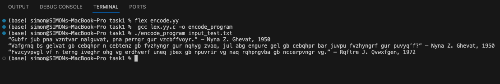
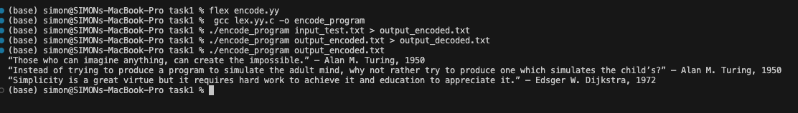
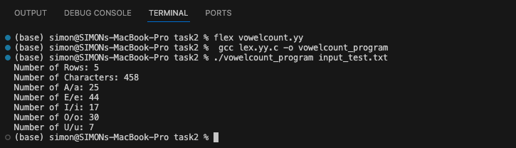
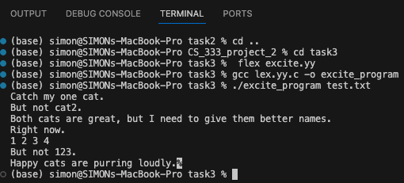
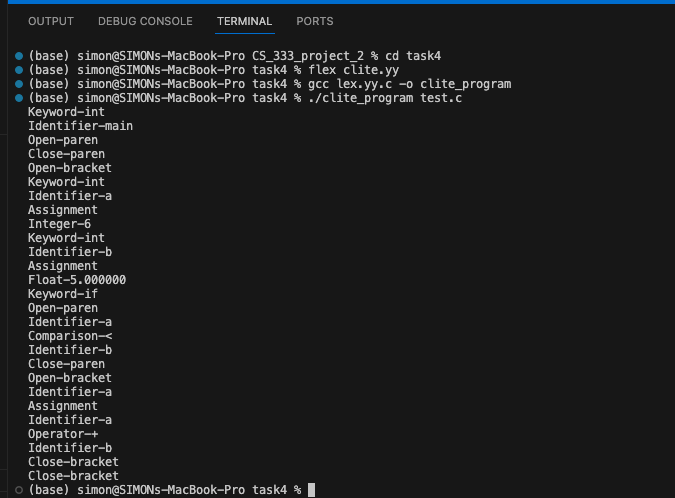

# CS_333_PROJECT_2_README #

Simon Lartey
10/04/2025

Google Site Report: https://sites.google.com/colby.edu/simon-project1/home?authuser=0

# Directory Layout #
```
.
├── JS
│   └── hello.js
├── MySQL
│   └── hello.sql
├── README.md
├── extension
│   ├── clite_extension.yy
│   ├── encoder_extension.yy
│   ├── encoder_program
│   ├── input.txt
│   └── output.txt
├── screenshots
│   ├── MySQL.png
│   ├── task1_decoded.png
│   ├── task1_encode.png
│   ├── task2.png
│   ├── task3.png
│   └── task4.png
├── task1
│   ├── encode.yy
│   ├── encode_program
│   ├── input_test.txt
│   ├── lex.yy.c
│   ├── output_decoded.txt
│   └── output_encoded.txt
├── task2
│   ├── input_test.txt
│   ├── lex.yy.c
│   ├── vowelcount.yy
│   └── vowelcount_program
├── task3
│   ├── excite.yy
│   ├── excite_program
│   ├── lex.yy.c
│   ├── output.txt
│   └── test.txt
└── task4
    ├── clite.yy
    ├── clite_program
    ├── lex.yy.c
    ├── output.txt
    └── test.c

```

# OS and C compiler #
OS: macOS Ventura 13.7.8   
C Compiler: Apple clang version 15.0.0 (clang-1500.0.40.1)  
Architecture: x86_64 (Intel-based Mac)


# Task 1: Encode Program #
The goal of this program was to encode and decode text by shifting each alphabetic character 13 positions forward in the alphabet (with wraparound). Non-alphabetic characters are left unchanged. Importantly, applying the program twice should return the original input, since a 13+13 shift completes the full alphabet cycle.

## How It Works ##
The Flex rules specify two key patterns:
**[A-Z]:** Matches uppercase letters. For each match, we compute the encoded character using ASCII math:
'A' + ((*yytext - 'A' + 13) % 26)

Here, *yytext gives the ASCII value of the character. Subtracting 'A' normalizes it to a 0–25 range. Adding 13 shifts forward, and % 26 wraps it if it passes Z.
**[a-z]:** Matches lowercase letters. The same logic is applied, except the base is 'a'.

Other characters (punctuation, digits, whitespace) are matched by . and printed unchanged.
For example, the letter T (ASCII 84) is normalized as 84 - 65 = 19. Adding 13 gives 32. Taking % 26 results in 6, which maps to the letter G. Thus, T becomes G, demonstrating the correctness of the shift.

## Input text (encode_test.txt): ##

```bash
Those who can imagine anything, can create the impossible.” – Alan M. Turing, 1950
Instead of trying to produce a program to simulate the adult mind, why not rather try to produce one which simulates the child’s?” – Alan M. Turing, 1950
Simplicity is a great virtue but it requires hard work to achieve it and education to appreciate it.” – Edsger W. Dijkstra, 1972
```

## How to Run ##
```
# 1. Generate the scanner
flex encode.yy

# 2. Compile the generated C file
gcc lex.yy.c -o encode_program -ll

# 3. Encode a file (example with input_test.txt)
./encode_program input_test.txt > output_encoded.txt

# 4. Decode back (run again on encoded file)
./encode_program output_encoded.txt > output_decoded.txt

```

## Output(encoded): ##


## Output(decoded): ##


These results show that the program works correctly. After the first run, every alphabetic character in the text is shifted forward by 13 positions. After running the program a second time, the text returns exactly to its original form. This confirms that the shifting rules in the code are correct and that the program can both encode and decode as expected.


# Task 2: Vowel Counter #
 
This program reads a text file and reports:  
- The number of rows (lines)  
- The total number of characters  
- The number of occurrences of each vowel **(a, e, i, o, u)**, case-insensitive  

---

## How It Works: ##  
The Flex rules handle categories of characters as follows:  

- **[aA]**, **[eE]**, **[iI]**, **[oO]**, **[uU]**: Each rule increments the respective vowel counter **and** the total character counter.  
- **\n**: Increments both the line counter and the character counter.  
- **.**  : A catch-all rule that increments the character counter for any non-vowel character.  

## Example: ## 
When the program encounters the letter **E** in *“Experience”*, the **[eE]** pattern matches. This increments both **num_e** and the overall **num_chars** counters, ensuring uppercase and lowercase vowels are handled equally.  

---

## Input text (input_test.txt): ##

```
Talk is cheap. Show me the code." – Linus Torvalds, 2000
Programs must be written for people to read, and only incidentally for machines to execute." – Harold Abelson, 1985
Any fool can write code that a computer can understand. Good programmers write code that humans can understand." – Martin Fowler, 1999
First, solve the problem. Then, write the code." – John Johnson
Experience is the name everyone gives to their mistakes." – Oscar Wilde
```


---

## How to Run ##
```
# 1. Generate the scanner
flex vowelcount.yy

# 2. Compile the generated C file
gcc lex.yy.c -o vowelcount_program

# 3. Run the program on the test file
./vowelcount_program input_test.txt
```

## Output(task2): ##



The output matches a manual inspection of the input text.By comparing several words in the input to the program’s reported counts, we can verify that the output is accurate. The counters match what we observe manually, demonstrating that the Flex rules increment vowels, characters, and rows correctly.


# Task 3: Excite Program #

The objective of this program was to make prose “slightly more exciting and less numeric.” Specifically:
Replace the word “cat” with “lion” and “cats” with “lions”. This replacement should occur only when these words appear standalone, not when embedded in larger words.
Replace standalone numbers 0–10 with their English word equivalents (e.g., 1 → one, 10 → ten). Numbers embedded in longer sequences (e.g., 123) should not be replaced.

## How It Works ##
The key patterns are:
```[[:<:]]cat[[:>:]]: Matches the word “cat” at word boundaries. This avoids incorrect substitutions like turning “Catch” into “lionch.”
[[:<:]]cats[[:>:]]: Matches “cats” as a standalone word.
[[:<:]]10[[:>:]] and [[:<:]]{DIGIT}[[:>:]]: Match standalone numbers. A helper function replace_number converts the numeric string to its word form using a lookup table.
```
For example, when the program encounters the input 3, the rule **[[:<:]]{DIGIT}[[:>:]]** matches. Inside replace_number, **atoi("3")** converts the string to the integer 3, which indexes into the array of words to print "three".

## Input Text (test.txt) ##

```
Catch my one cat.
But not cat2.
Both cats are great, but I need to give them better names.
Right now.
1 2 3 4
But not 123.
Happy cats are purring loudly.

```

## How to run ##
```
# 1. Generate the scanner
flex excite.yy

# 2. Compile the generated C file
gcc lex.yy.c -o excite_program -ll

# 3. Run the program on the test file
./excite_program excite_test.txt > output_excited.txt

```

## Output ##


The results confirm that the everything works correctly:
“cat” → “lion” and “cats” → “lions” only when matched as standalone words (avoiding errors like “Catch” → “lionch”).
Standalone digits such as 1 and 10 were successfully replaced with “one” and “ten”.
The sequence 123 remained unchanged, demonstrating that the word boundary rules prevent unintended replacements.


 
# Task 4: Clite Scanner #
This task involved writing a scanner for a subset of the Clite programming language. The scanner identifies keywords, identifiers, integers, floats, operators, comparisons, assignments, and brackets/parentheses. The output is a sequence of tokens, one per line.

## How It Works ##
**The Flex file defines token rules:**

```
if|else|while|for|int|float: Matches keywords and prints them as Keyword-<word>.

[0-9]+\.[0-9]+: Matches floats. For consistency, floats are normalized to six decimal places using atof. For example, 5.0 is printed as Float-5.000000.

0|[1-9][0-9]*: Matches integers.

[A-Za-z_][A-Za-z_0-9]*: Matches identifiers (e.g., variable names).

"=": Matches assignment.

"<="|">="|"=="|"<"|">": Matches comparisons.

"+"|"-"|"*"|"/": Matches arithmetic operators.

"{" and "}": Match brackets.

"(" and ")": Match parentheses.

```

For example, when the program encounters int a = 6;, the tokens produced are:
```
Keyword-int
Identifier-a
Assignment
Integer-6
```
This shows how keywords, identifiers, and literals are separated and classified.

## How to run ##
```
# 1. Generate the scanner
flex clite.yy

# 2. Compile the generated C file
gcc lex.yy.c -o clite_program -ll

# 3. Run the scanner on the test file
./clite_program test.c > output.txt

```

## Output ##


The Clite scanner correctly identifies keywords, identifiers, operators, assignments, and literals. For example, the line float x = 5.0; produces:

```
Keyword-float
Identifier-x
Assignment
Float-5.000000
```
This demonstrates that the rules handle both keywords and numeric literals properly, while also ignoring formatting and comments. The output matches expectations, confirming the correctness of the scanner.


# EXTENSIONS #
## Extension_1 ##
For the first extension, I decided to implement what can be described as a progressive Caesar cipher, where the amount of shift applied depends on the character’s position in the text. In this design, the first alphabetic character is shifted by +1, the second by +2, the third by +3, and so on, with wraparound at the end of the alphabet. This means that every letter in the input text is encoded differently depending not only on its identity but also on where it appears in the file.

The effect of this extension can be seen with a simple example. If the input is ABC, the program produces BDF. This happens because the first character A is shifted by one position, resulting in B. The second character B is shifted by two positions, becoming D. Finally, the third character C is shifted by three positions, producing F. Unlike a normal Caesar cipher with a constant shift, this progressive scheme ensures that even repeated letters may be transformed into different outputs depending on their position. This makes the encoding less predictable.

Non-alphabetic characters such as spaces, punctuation, and newlines are left unchanged in the output to preserve readability, but in the implementation they still contribute to the position counter. For example, if there is a space before a letter, the position counter is incremented, meaning the shift for the next letter is slightly larger. This decision makes the cipher more challenging to reverse, because the shift applied to each character cannot be determined without carefully tracking the entire sequence of characters in the input.

## Extension_2 ##
For my second extension, I enhanced the Clite parser by adding proper comment handling and float normalization. I introduced rules to ignore both single-line (// ...) and multi-line (/* ... */) comments so they no longer appear in the token stream. I also modified the float rule to convert values into doubles and print them with six decimal places using %f. This ensures consistent output such as Float-5.000000, regardless of how the literal was written. These changes make the parser cleaner, more consistent, and closer to the behavior of a real compiler’s lexer.

## Extension_3 ##
For my third extension, I chose to go beyond Flex and explore a new programming language as an additional learning opportunity. I created a dedicated section for SQL, gathering documentation and resources such as official references and tutorials that explain syntax and common commands. To make the learning practical, I implemented a simple SQL “Hello World” program that goes beyond just printing text by creating a table, inserting values, and retrieving them with a SELECT query. I annotated each resource and code example so that they function as a reference manual for future work.