# CS333 - Project 3 - README #
Simon Lartey
10/20/2025
Google Sites Report: https://sites.google.com/colby.edu/simon-project1/home?authuser=0


```
.
├── Extension
│   ├── builtin_binary_search.js
│   ├── language_comparison.js
│   ├── language_comparison.py
│   ├── obfuscated_binarysearch.js
│   └── sql_extension.sql
├── JS
│   ├── task1.js
│   ├── task2.js
│   ├── task3.js
│   ├── task4.js
│   └── task5.js
├── README.md
├── cstk.c
├── cstk.h
├── cstk2.c
├── cstk2.h
├── cstktest
├── cstktest.c
├── cstktest2
├── cstktest2.c
├── screenshots
│   ├── builtIn_Binary_Search.png
│   ├── cstktest2.png
│   ├── language_comparison_javaScript.png
│   ├── language_comparison_python.png
│   ├── mark1.png
│   ├── mark2.png
│   ├── task3.png
│   └── task6.png
└── stack_visualization.c
```

# OS and C compiler #
OS: macOS Ventura 13.7.8   
C Compiler: Apple clang version 15.0.0 (clang-1500.0.40.1)  
Architecture: x86_64 (Intel-based Mac)

# Project Overview #
This project was all about exploring how different programming languages express logic, manage memory, and handle data.  
It started with a hands-on implementation of a **stack data structure in C**, where I worked directly with heap memory and pointers.  
From there, I moved into **JavaScript**, examining how a higher-level language simplifies those same concepts.  
Finally, through a series of **extensions**, I compared syntax and design philosophies across JavaScript, SQL, and Python.


## Part I — Stack Implementation in C

In this first section, I implemented a basic **stack** using arrays and pointers in C.  
The code was separated into two files:  
- `cstk.h` contained the structure and function declarations.  
- `cstk.c` implemented the actual logic for creating, pushing, popping, and destroying stacks.

```c
typedef struct Stack {
    int *data;      // heap-allocated memory for elements
    int *top;       // points to the next available slot
    int capacity;   // total stack capacity
} Stack;


The stack itself lived on the heap, while the pointer to it (Stack *s) lived on the program stack.
This distinction—between where data is stored and where it’s referenced—became clearer as I observed how each operation affected memory.

```

 ## Core Functions and Behavior ##

``` The implementation included all standard stack operations:

stk_create(capacity) – allocates a new stack on the heap.

stk_push() – writes a value at the address pointed to by top and moves the pointer forward.

stk_pop() – moves top backward and returns the last value.

stk_peek() – returns the top element without modifying the stack.

stk_destroy() – frees all allocated heap memory.
```

## Run and Compile ##
```bash
gcc -o cstktest cstktest.c cstk.c
./cstktest
```

## Output ## 

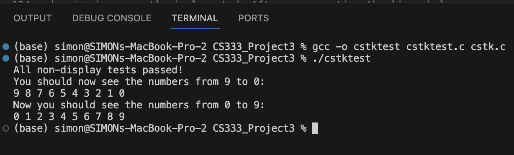


## Task 4: Testing Memory Deallocation (stk_destroy) ##

Toward the end of the test file, I added a stress test that continuously created and destroyed stacks:
```c
while (1) {
    Stack *s = stk_create(100000);
    stk_destroy(s);
}
```

The purpose was to confirm that the memory cleanup in stk_destroy() actually worked.
Running this loop while watching my system’s resource monitor showed that memory usage stayed constant, meaning no leaks occurred.
<a href="https://drive.google.com/file/d/1GyVw0l6NaGaBOWvqyQcQBi0uPw4Zr-ja/view?usp=sharing" target="_blank">Watch the video demonstration here.</a>
This simple test gave me visual confirmation that memory was being freed properly after each iteration.


## Task 5: Visualizing Memory ##
### Memory Visualization at Mark 1 and Mark 2

To better understand how data and addresses are organized in memory, I drew two diagrams that capture the state of the program at two key points in execution — **Mark 1** (after creating the stack) and **Mark 2** (after destroying it).  
These sketches illustrate how stack variables and heap allocations interact in C.

---

#### Mark 1 — Stack and Heap Relationship Before Destruction
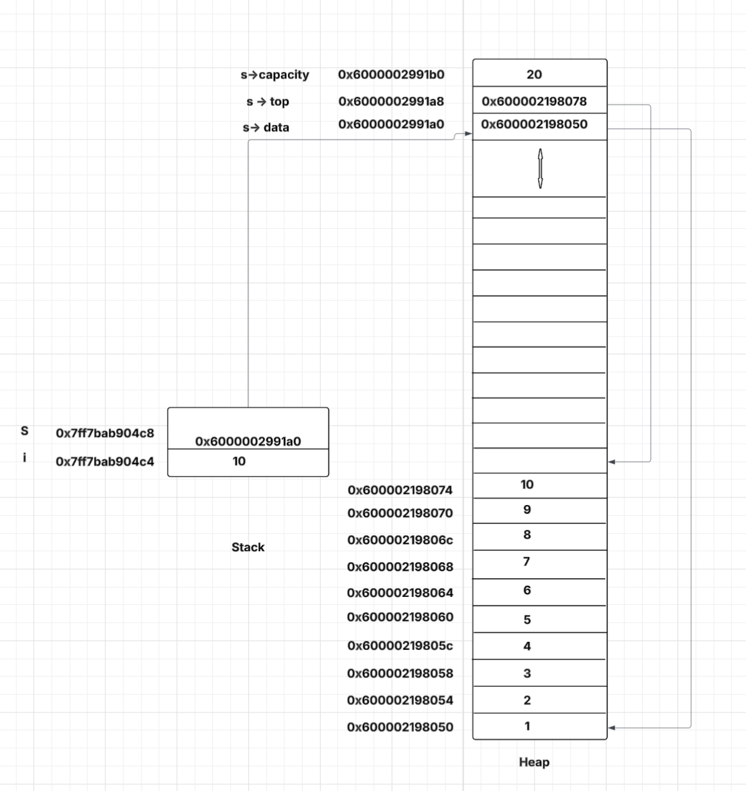

At Mark 1, a **Stack** structure is created dynamically on the heap using **malloc()**, and a pointer to this structure (`s`) is stored on the stack.  
Alongside it, the integer variable **i** is also on the stack, holding the value **10**.

On the **stack**, we have:
- **i** at address **0x7ff7bab904c4**, storing the integer **10**
- **s** at address **0x7ff7bab904c8**, holding the pointer value **0x6000002991a0**, which refers to the heap location where the actual stack data resides

On the **heap**, memory has been allocated for three main fields within the **Stack** struct:
- **s->data** — points to the start of the integer array that holds pushed elements  
- **s->top** — points to the next available position in that array  
- **s->capacity** — stores the total number of elements the stack can hold  
Each value pushed onto the stack (1 through 10) occupies consecutive memory locations on the heap.  
This shows the contiguous nature of **malloc()** allocations — the heap grows upward, while stack addresses decrease downward.

In essence, at this point:
- The **stack** stores the *addresses* of things.  
- The **heap** stores the *actual data*.  
- The pointer **s** acts as a bridge between them.

---

#### Mark 2 — After Calling **stk_destroy()**
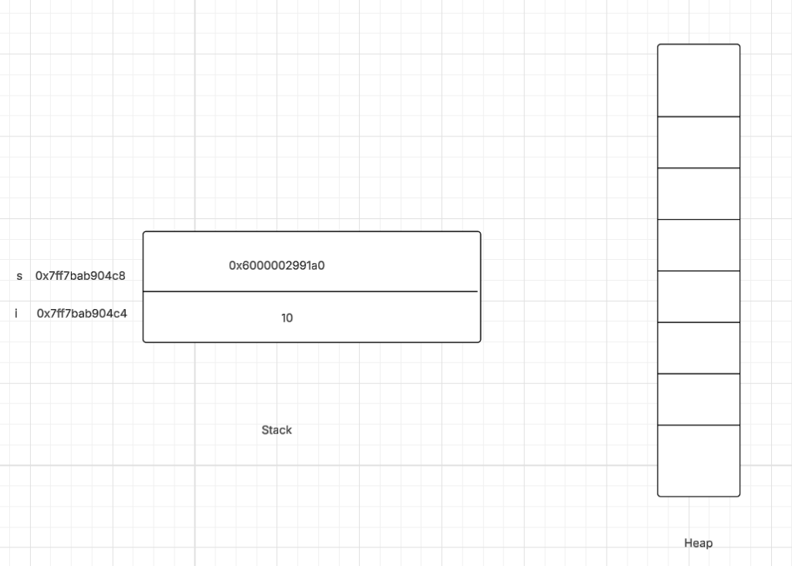

At Mark 2, the **stk_destroy(s)** function has been called, freeing the heap memory that was allocated for the **Stack** structure and its data array.  
This means the address `0x6000002991a0`, which once pointed to valid heap memory, is now invalid and should not be dereferenced.

However, even after freeing memory, the variable `s` on the stack still retains the old pointer value.  
This emphasizes an important concept:  
> Freeing heap memory does not automatically clear the pointer variable that referenced it.

If I were to print **s** after destruction, it would still show the same address (**0x6000002991a0**), even though that memory space is no longer valid.  This behavior is what we call a **dangling pointer**—a common source of bugs and undefined behavior in C.


Comparing Mark 1 and Mark 2 made the relationship between the stack and heap very concrete for me.  
It clarified that while variables on the stack disappear automatically when a function returns, heap-allocated memory persists until explicitly released.  
The exercise also reinforced the importance of calling **free()** (or in this case, **stk_destroy()**) to prevent memory leaks, and why setting a pointer to **NULL** afterward is good practice.

These visualizations bridged the gap between abstract memory diagrams and the actual runtime behavior of my program.


## Task6 ##
To push the design further, I wrote a second version of the stack (cstk2.c) that could handle multiple data types using void * pointers.
This allowed me to store not just integers, but strings and structs as well.
When tested with cstktest2.c, it printed both numerical and string-based elements, confirming that the structure could be reused for different data types.

## Output: ##
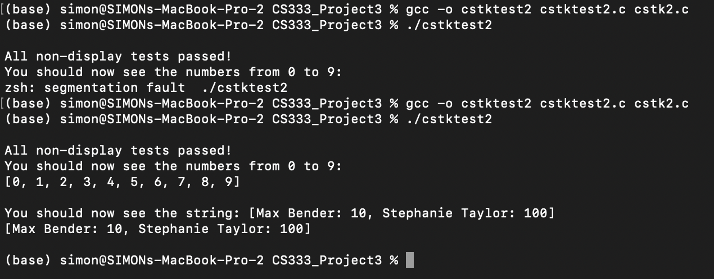


## Mark 1 Memory Diagram ##
This is the memory diagram at Mark1 of toDraw2.c
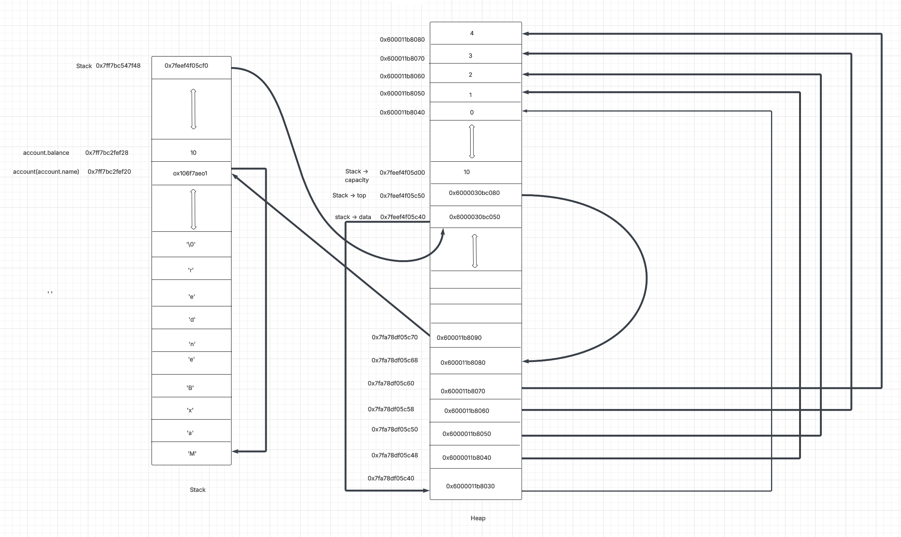


## PART II ##

### Exploring JavaScript as the selected language ###

### Task 1 — Identifier Rules and Scoping ###
In task1.js, I experimented with how JavaScript defines and scopes variables using var, let, and const.
```c
let userName = "Simon";
let _count = 5;
let $price = 19.99;
```
I learned that let and const are block-scoped—similar to how C limits variable lifetimes within {}—while var is function-scoped.
This small distinction affects how variables persist and interact.

## Ouptut ##
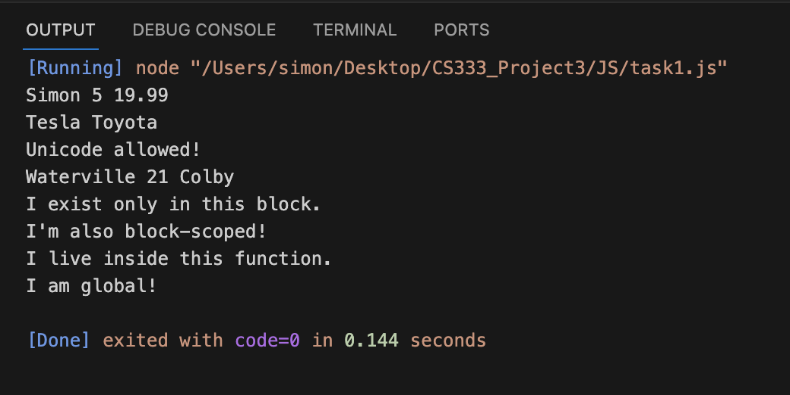

## Task 2 — Binary Search Algorithm ##
This was the JavaScript equivalent of the earlier C stack logic

```js
function binarySearch(arr, target) {
    let left = 0, right = arr.length - 1;
    while (left <= right) {
        const mid = Math.floor((left + right) / 2);
        if (arr[mid] === target) return mid;
        arr[mid] < target ? left = mid + 1 : right = mid - 1;
    }
    return -1;
}
```

The program found a target value efficiently without worrying about pointer safety or memory boundaries. something C would never allow without explicit checks.

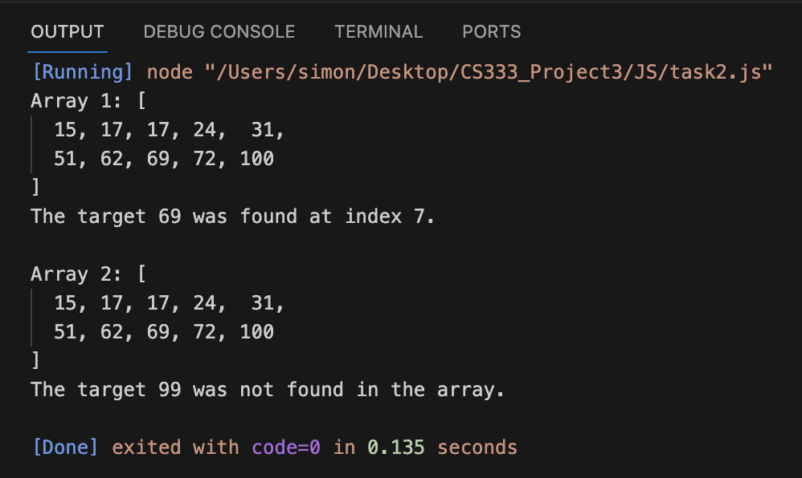

## Task 3 — Data Types and Operators ##
In this task, I explored how JavaScript handles different data types. My code printed examples of primitive types (Boolean, Null, Undefined, String, Number, BigInt, Symbol) and objects such as arrays and classes.
For instance, I used a simple Vehicle class to show how JavaScript supports object-oriented features even without static typing:

```js
class Vehicle {
  constructor(make, year) {
    this.make = make;
    this.year = year;
  }
  display() {
    console.log(`${this.make} was made in ${this.year}`);
  }
}
let car = new Vehicle("Toyota", 2020);
car.display();
```
This task showed that JavaScript determines types at runtime, unlike C, which enforces them at compile time—making it flexible but potentially error-prone when handling mixed types.
## output: ##

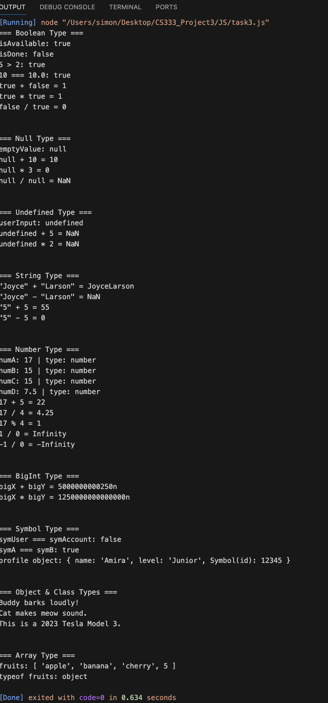

## Task 4 — Control Flow ##

This task explored JavaScript’s control flow through a mix of conditionals, loops, branching, and error handling.
For example, I used this conditional to categorize grades:
```js
if (grade === "A") {
  console.log("Excellent!");
} else if (grade === "B") {
  console.log("Good job!");
} else {
  console.log("Needs improvement.");
}
```

Unlike C, JavaScript automatically checks variable initialization and protects against unsafe memory access, so logic errors rarely crash the program.
It was a clear reminder of how much lower-level control—and responsibility—C gives the programmer.

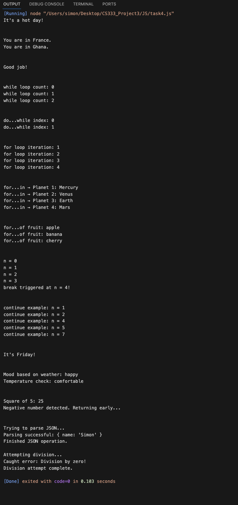


## Task 5 — Functions as Data ##
In this final task, I explored how JavaScript treats functions as data—they can be assigned to variables, passed around, and even returned from other functions.
One example was a higher-order function that chose an operation to return:
```js
function chooseMathOperation(choice) {
  switch (choice) {
    case 1: return (a, b) => a + b;
    case 2: return (a, b) => a - b;
  }
}
const adder = chooseMathOperation(1);
console.log(adder(6, 9)); 
```

I also created arrow functions and closures, such as:

```js
function createExponentFunction(power) {
  return (number) => number ** power;
}
const squareNum = createExponentFunction(2);
console.log(squareNum(8)); 


Writing this helped me appreciate JavaScript’s flexibility—functions are not just routines; they’re objects that can carry state and behavior.
It felt very different from C, where functions can’t be stored or returned like this.
```

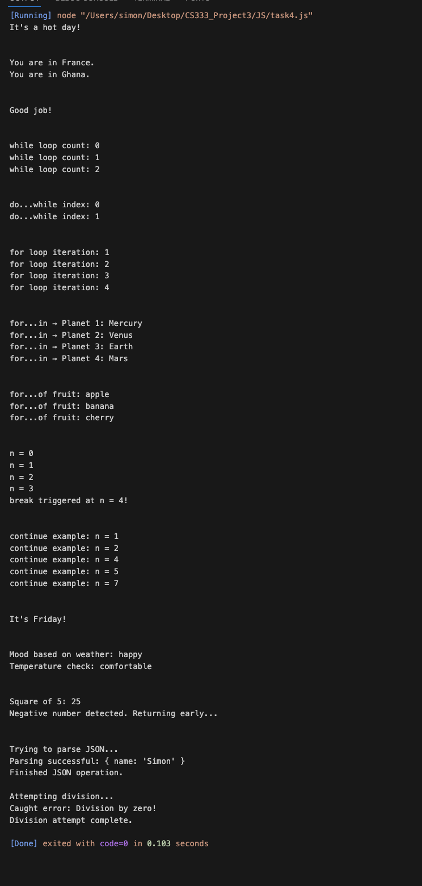


## Extensions ##
Extensions

This section summarizes the additional work I completed to extend the core project.
A more detailed explanation and reflection for each extension is available on my Google Site page.

### Built-in Binary Search ###
I compared JavaScript’s indexOf() and findIndex() methods with a manual binary search implementation. The goal was to see how built-in functions simplify searching compared to algorithmic logic written from scratch.

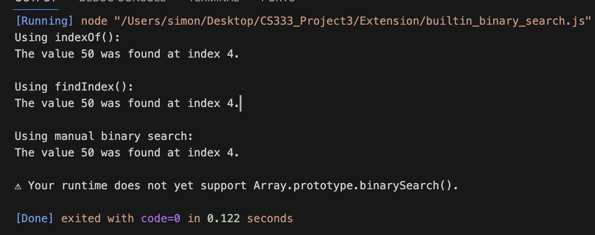

### Obfuscated Binary Search ###
I rewrote the binary search algorithm in an intentionally unreadable way to highlight the importance of clean, well-formatted code for maintainability.

### SQL as a Second Language ###
I experimented with SQL to understand its declarative syntax and how it differs from JavaScript’s procedural style when working with data.

### Language Comparison (JavaScript vs Python) ###
I recreated similar logic in both languages to observe differences in structure and readability. Python’s indentation-based syntax contrasted nicely with JavaScript’s use of braces.
