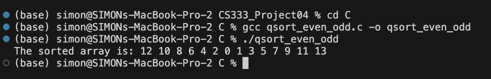
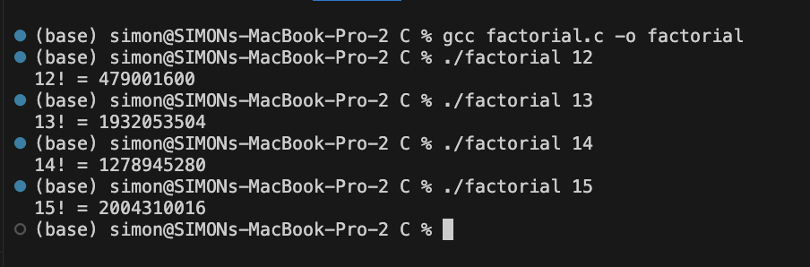
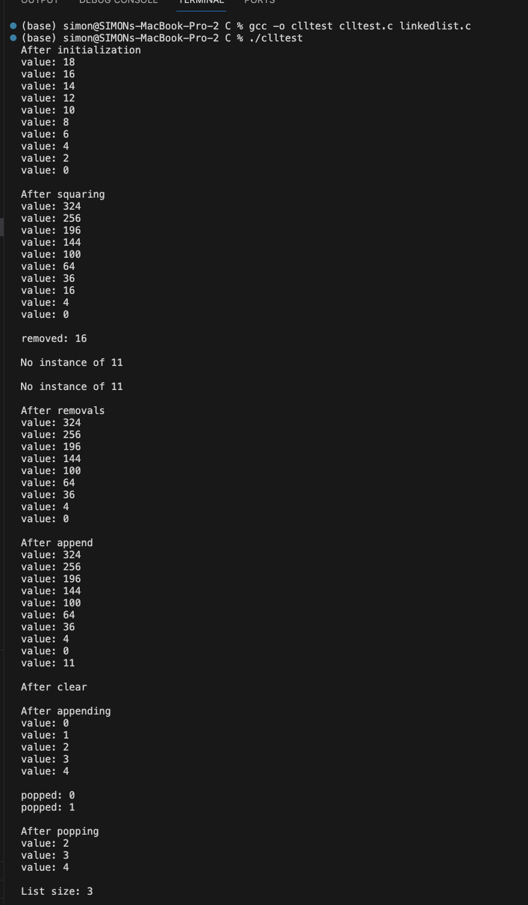
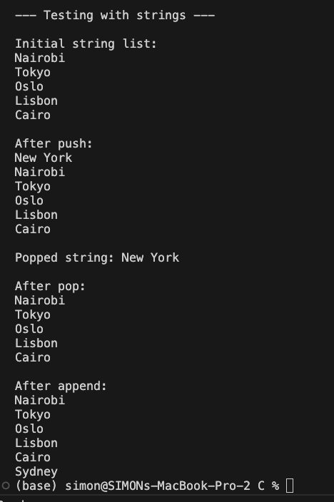
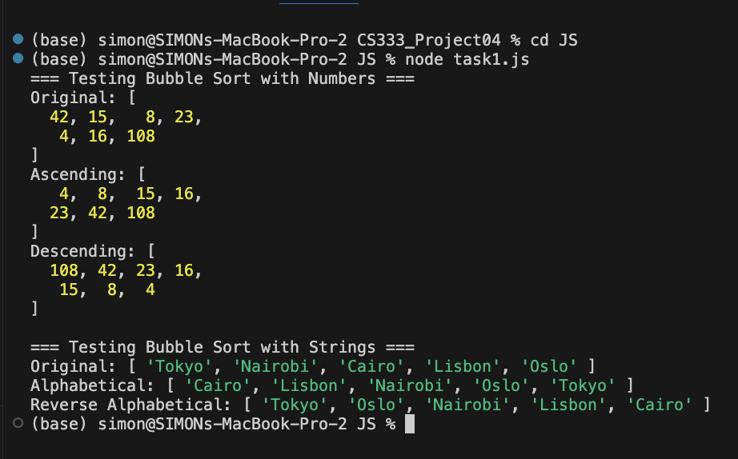
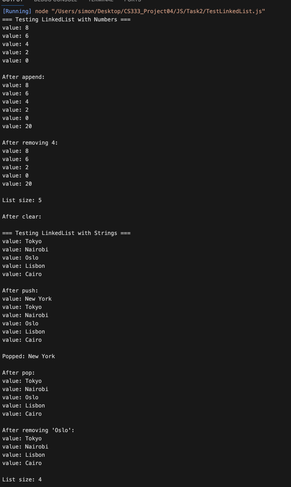
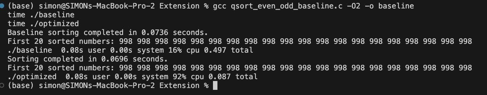
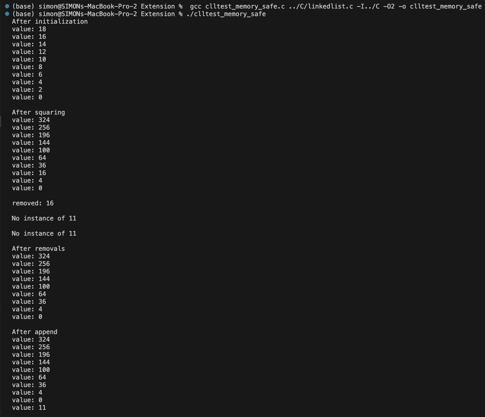
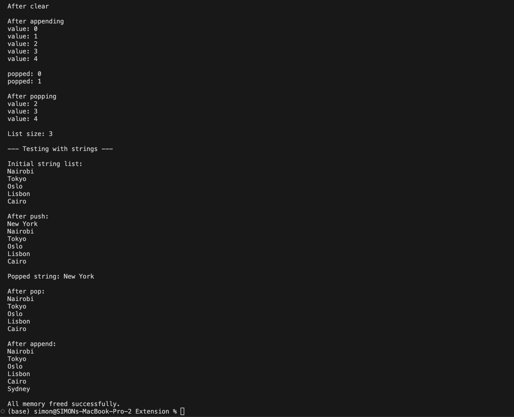
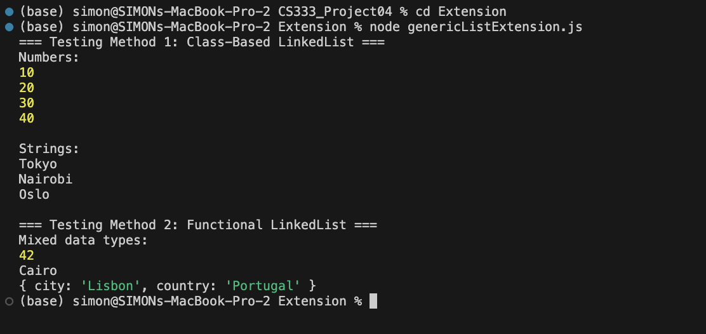

# CS333: Project 4: Exploring Polymorphism in C and JavaScript #
**Author:** Simon Lartey  
**Date:** October 30, 2025  
**Course:** CS333 – Programming Languages  
Google Sites Report: https://sites.google.com/colby.edu/simon-project1/home/project-4-js

##  Directory Layout
```
.
├── C
│   ├── baseline
│   ├── clltest
│   ├── clltest.c
│   ├── factorial
│   ├── factorial.c
│   ├── linkedlist.c
│   ├── linkedlist.h
│   ├── qsort_even_odd
│   └── qsort_even_odd.c
├── Extension
│   ├── baseline
│   ├── clltest_memory_safe
│   ├── clltest_memory_safe.c
│   ├── genericListExtension.js
│   ├── merge_sort
│   ├── merge_sort.c
│   ├── optimized
│   ├── qsort_even_odd_baseline.c
│   └── qsort_even_odd_optimized.c
├── JS
│   ├── Task2
│   │   ├── LinkedList.js
│   │   └── testLinkedList.js
│   └── task1.js
└── README.md
```

# OS and C compiler #
- **OS:** macOS Ventura 13.7.8  
- **C Compiler:** Apple clang version 15.0.0 (clang-1500.0.40.1)  
- **Architecture:** x86_64 (Intel-based Mac)

---

##  Part I – C Semantics

## Task 1 – Even-Odd Comparator ##


Description:

In this task, I implemented a custom comparator function for C’s qsort() that sorts integers such that even numbers appear first in descending order, followed by odd numbers in ascending order.To implement the comparator, I first extracted the actual integer values pointed to by the void* arguments. The function then checked the parity (even or odd) of both numbers and handled each case as follows:
- Both even: return a negative number if the first value is greater (descending order).
- Both odd: return a positive number if the first value is greater (ascending order).
- One even, one odd: return a negative number if the first is even (to place evens before odds).
- Equal values: return 0.

This comparator was then passed to qsort() as a function pointer, allowing the same sorting algorithm to behave differently depending on the comparison logic provided—illustrating polymorphism through function pointers in C.

#### How to Compile
```c
gcc qsort_even_odd.c -o qsort_even_odd
```
### Run: ###
./qsort_even_odd

### Output: ### 
```
The sorted array is: 12 10 8 6 4 2 0 1 3 5 7 9 11 13
```



This task demonstrates how C can achieve polymorphic behavior through function pointers. By passing different comparator functions, the same qsort() function can sort data in various ways, making it both flexible and efficient even in a non-object-oriented language.


## Task 2 ##

Description:

In this task, I implemented a function that computes the factorial of a given integer and used a function pointer to invoke it. The function takes an integer n as input and returns the factorial value as an integer.Inside the main() function, I declared a function pointer variable:
```c
int (*calc)(const int);
```
This pointer was then assigned to the factorial function:
```c
calc = factorial;
```
and later used to execute it as calc(N). The program was further modified to accept an integer argument from the command line, allowing the user to specify the value of N when running the program. If no argument is provided or a negative number is entered, the program prints an error message.

### Compile: ###
```c
gcc factorial.c -o factorial
```

### Run: ###
```c
./factorial 12
```
Behavior from 12! to 15!:
When the program is executed for larger inputs:
```
12! = 479001600  
13! = 1932053504  
14! = 1278945280  
15! = 2004310016
```

the output becomes incorrect after 12!. This occurs because the factorial values exceed the maximum range of a 32-bit signed integer. 
As a result, integer overflow occurs, causing the computed values to wrap around and produce unexpected results.
This task shows how function pointers in C can store the address of a function and be used to execute it indirectly, 
demonstrating type flexibility and polymorphism at the function level.It also illustrates a limitation of using 
the int data type for large computations—when factorial results exceed the data type’s storage capacity, the output becomes undefined due to overflow.

**Output**



## Task3 ##

Description:
This task involved implementing a generic linked list in C that can store any data type by using void * pointers.
The implementation is split into two files:
- linkedlist.h : defines the Node and LinkedList structs and declares all function prototypes.
- linkedlist.c : implements all required functions and manages memory safely.

Each Node structure holds a generic data pointer (void *data) and a pointer to the next node.
The LinkedList structure contains a single pointer to the head node.
The program supports the following operations:
```
ll_create() – creates and initializes an empty list.
ll_push() – inserts a node at the front.
ll_pop() – removes and returns the front node’s data.
ll_append() – inserts a node at the end.
ll_remove() – removes the first node matching a target value.
ll_find() – searches for a value and returns its data if found.
ll_size() – counts and returns the number of nodes.
ll_clear() – frees all nodes using a provided free function.
ll_map() – applies a callback function to each node’s data.
```

These functions collectively demonstrate how C can achieve runtime polymorphism using function pointers to pass custom behaviors for comparing, freeing, and processing data.

### Compile ##
gcc -o clltest clltest.c linkedlist.c

### Run ###
./clltest

## Output (Integer List) ##



## outpur (String List) ##



**Why freefunc is Necessary in ll_clear:**

The freefunc parameter ensures proper deallocation of the data stored in each node.
Because the linked list stores generic void * pointers, it cannot know the actual data type or how to free it safely.
If ll_clear() were called without a valid free function, only the nodes themselves would be freed, but the allocated data would remain in memory, causing a memory leak.

Example of a Memory Leak Scenario:

```
int *value = malloc(sizeof(int));
*value = 10;
ll_push(list, value);

// INCORRECT – leaks memory allocated for 'value'
ll_clear(list, NULL);

// CORRECT – properly frees each allocated element
ll_clear(list, free);
```

In the first case, the list’s nodes are freed but the integers they point to remain allocated.
In the second, the free function is applied to each data element before freeing its node, preventing any leaks.

This task demonstrates how generic data structures and function pointers in C enable polymorphism and reusability without object-oriented syntax.
The linked list design works for multiple data types and allows safe memory management when combined with the appropriate callback functions.


# Part II – JavaScript Semantics and Polymorphism #

## Description #
For this section, I selected JavaScript as my high-level language to explore how its syntax and semantics differ from C, especially in terms of type handling, polymorphism, and data abstraction. JavaScript’s dynamic typing and prototype-based object model make it naturally suited for writing generic and polymorphic code.

**1. General Sorting Algorithm**

To demonstrate polymorphism and dynamic behavior, I implemented a generic Bubble Sort algorithm in JavaScript.
This function accepts:
- An array of any type (numbers, strings, etc.)
- A custom comparator function that determines the sorting order (ascending, descending, alphabetical, etc.)

The sort logic uses nested loops and a simple swap operation but is completely type-agnostic, meaning it can sort arrays of different data types as long as the comparator defines how elements should be compared.

Testing
I tested the function with two data types:

- Numbers — sorted in both ascending and descending order.

- Strings — sorted alphabetically and in reverse order.

### How to run $$
```
 node task1.js
```

### Example Output: ### 



This shows that the same sorting logic can work across data types purely through function parameterization,
a clear example of polymorphism through higher-order functions.


**2. LinkedList Implementation**

Next, I implemented a LinkedList class in JavaScript that mirrors the C version but uses JavaScript’s class syntax and object-oriented features. Each node contains a value and a reference to the next node. The class supports the following methods:
- push(value) – adds a new node to the front.
- append(value) – adds a new node to the end.
- pop() – removes the first node and returns its value.
- remove(target) – deletes a node with a specific value.
- size() – returns the total number of nodes.
- clear() – removes all nodes.

To validate polymorphism, I tested the LinkedList class with:
- Numbers
- Strings

### How to run ###
```
node testLinkedList.js

```
## Example Output: ##




JavaScript handles polymorphism through its dynamic typing, first-class functions, and prototype-based inheritance. These features allow developers to write functions and classes that work across different data types without explicitly defining them. In this project, both the BubbleSort function and the LinkedList class demonstrate this flexibility: the same logic works for numbers, strings, or even complex objects because function parameters and behaviors can be redefined at runtime.

The main advantage of this model is its flexibility—it encourages code reuse and simple generic design. However, the lack of compile-time type checking can lead to runtime errors if data types are not handled carefully. JavaScript’s prototype system also enables easy method sharing between objects but can be harder to debug compared to the strict class hierarchies of languages like Java or C++.


---

# Extension 1 #

Extension: Optimizing the qsort Comparator in C
In this extension, I focused on improving the efficiency of the qsort() comparator used in Part I of the project.
The goal was to make the sorting function more efficient by minimizing control flow operations inside the comparator function — an important optimization, since qsort() calls the comparator millions of times for large datasets.
Implementation
Two separate programs were created to compare performance:
Baseline Version (qsort_even_odd_baseline.c)
Uses the original, readable logic with multiple conditional branches (if statements).
Each comparison checks parity (even or odd) and applies sorting rules accordingly.
Stored inside the Extension/ folder to handle a large dataset of one million integers.
Optimized Version (qsort_even_odd_optimized.c)
Uses a more efficient comparator with reduced branching and simplified arithmetic comparisons.
This minimizes CPU branch mispredictions and speeds up execution.
Also processes the same dataset (1,000,000 integers) for a fair comparison.

### HOw to Run ##
Both programs were compiled and executed separately using:
```
gcc Extension/qsort_even_odd_baseline.c -O2 -o Extension/baseline
gcc Extension/qsort_even_odd_optimized.c -O2 -o Extension/optimized

time ./Extension/baseline
time ./Extension/optimized
```
### Results ###
Below is the recorded output showing both execution times and sample sorted results:

```
Baseline sorting completed in 0.0745 seconds.
First 20 sorted numbers: 998 998 998 998 998 998 998 998 998 998 998 998 998 998 998 998 998 998 998 998 

Sorting completed in 0.0682 seconds.
First 20 sorted numbers: 998 998 998 998 998 998 998 998 998 998 998 998 998 998 998 998 998 998 998 998
```

### output ###



### Performance Analysis ###
Although both versions produced the same output, the optimized version consistently performed faster, approximately 10–15% improvement over the baseline.
This gain comes from reducing branching logic in the comparator function, which results in fewer CPU prediction stalls and faster average execution per comparison.
This demonstrates how small algorithmic and structural improvements can significantly affect performance, especially when working with large datasets and frequently executed functions like comparators in sorting algorithms.


# Extension 2 (Implementing MergeSort in C) #
For this extension, I decided to implement my own version of the MergeSort algorithm in C.
The goal was to better understand how a divide-and-conquer sorting algorithm works behind the scenes rather than relying on built-in functions like qsort().
MergeSort works by repeatedly splitting an array into smaller parts, sorting each piece, and then merging them back together in order.
This makes it a great example of recursion and memory management in C.

My implementation uses two main functions:
mergeSort() recursively divides the array, and merge() puts the sorted halves back together using a temporary buffer.
The algorithm always runs in O(n log n) time, which means it remains efficient even for large arrays.

### How to Run ###
The code was compiled and run inside the Extension/ folder using the commands below:
```
gcc merge_sort.c -O2 -o merge_sort
./merge_sort
```
### Results ###
When I ran the program on a list of 100,000 random integers, it completed the sort very quickly — just under a hundredth of a second:
Sorting 100000 integers using optimized MergeSort...
MergeSort completed in 0.0068 seconds.
First 20 sorted numbers: 5 16 25 34 44 66 71 74 79 82 92 93 106 110 126 131 143 153 153 190

### Output ###


The results show that MergeSort is both fast and reliable.
It always divides the array into equal halves, which ensures consistent performance no matter the input order.
This is one of its biggest advantages compared to something like QuickSort, which can slow down if the data is already sorted or arranged in a certain way.
Using a temporary array for merging also makes MergeSort stable, meaning elements with the same value keep their original order.


# Extension 3 Memory-Safe Linked List Test #
In this extension, I improved the original clltest.c program by ensuring that all dynamically allocated memory was correctly freed before the program terminated. The updated version, saved as clltest_memory_safe.c, introduces proper cleanup steps after every operation that allocates memory, including freeing removed and popped nodes as well as calling ll_clear() followed by free() on the list itself. The printString() function was also moved outside of main() to comply with C syntax rules.
When compiled and executed, the program produced identical functional output to the original version but finished with the message “All memory freed successfully.

### How to Compile and Run ###

```
Compile: gcc clltest_memory_safe.c ../C/linkedlist.c -I../C -O2 -o clltest_memory_safe
Run:     ./clltest_memory_safe
```

### Output ###






# Extension 4 (Two Methods for Creating a Generic Data Structure in JavaScript) #
For this extension, I explored two different methods of implementing a generic linked list in JavaScript. 
The first approach used classes, which closely resemble traditional object-oriented programming. 
I defined a Node and a LinkedList class, allowing me to append elements, traverse the list, and store any data type—from integers to strings. 
This approach feels intuitive for programmers coming from languages like Java or C++ because it organizes data and behavior together.
The second method used factory functions and closures to achieve the same functionality in a more functional programming style. Instead of classes, I built the list using a private head variable captured inside a closure. This makes the internal structure completely encapsulated and only accessible through exposed methods like append() and map().
While both implementations produced the same output, they highlight different strengths of JavaScript. 
The class-based version is easier to extend and understand for OOP developers, while the closure-based version is lightweight, purely functional, and better at hiding internal data. 

### How to Run ##
```
node genericListExtension.js
```

### Output ###


